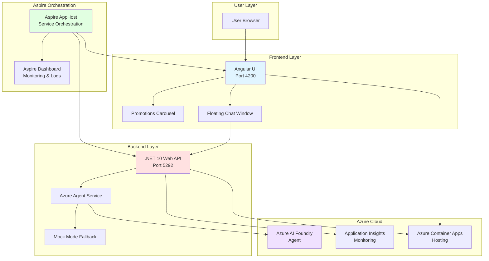
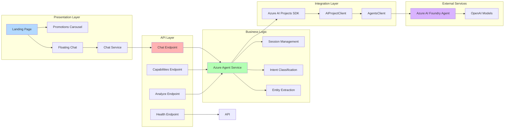
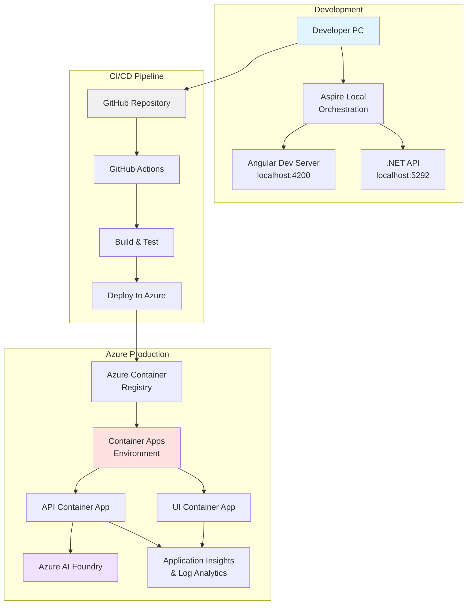
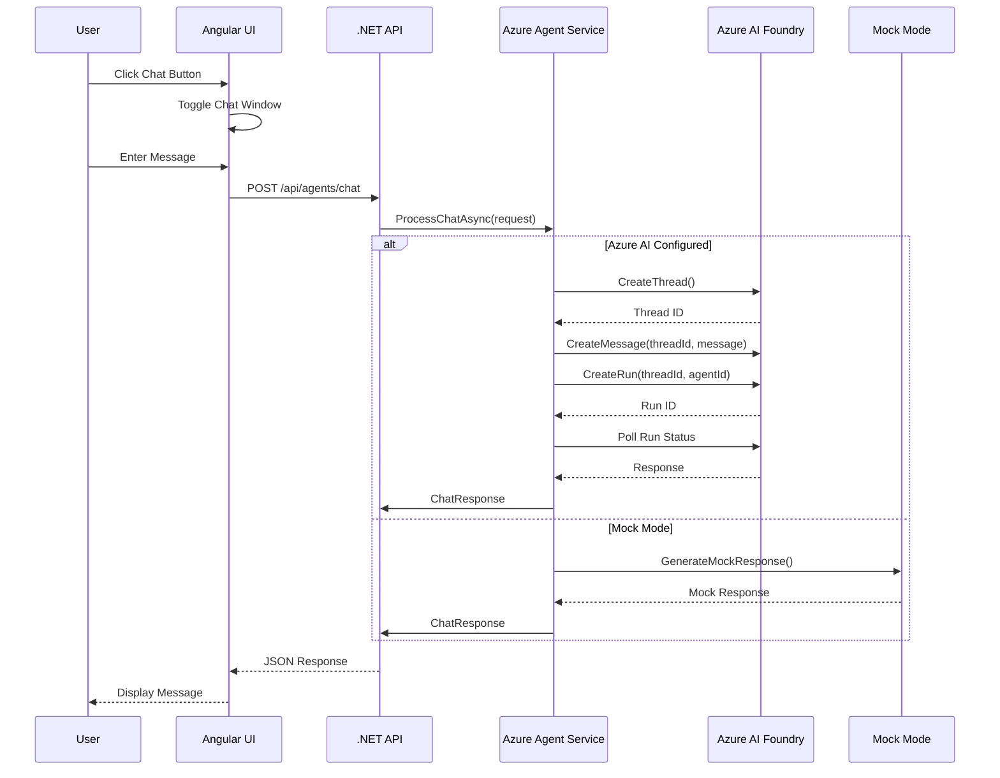
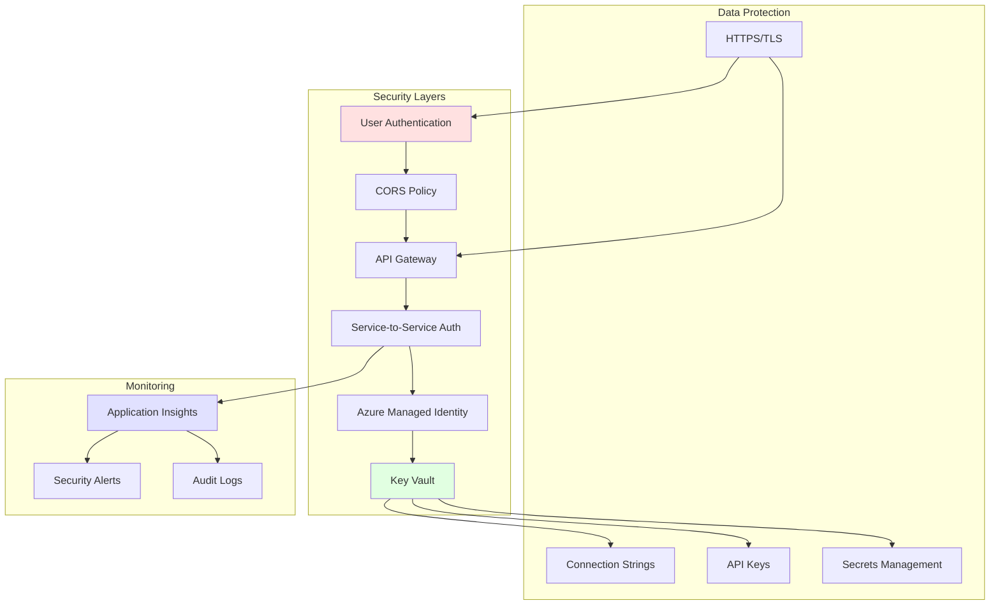
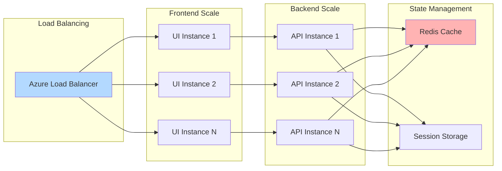
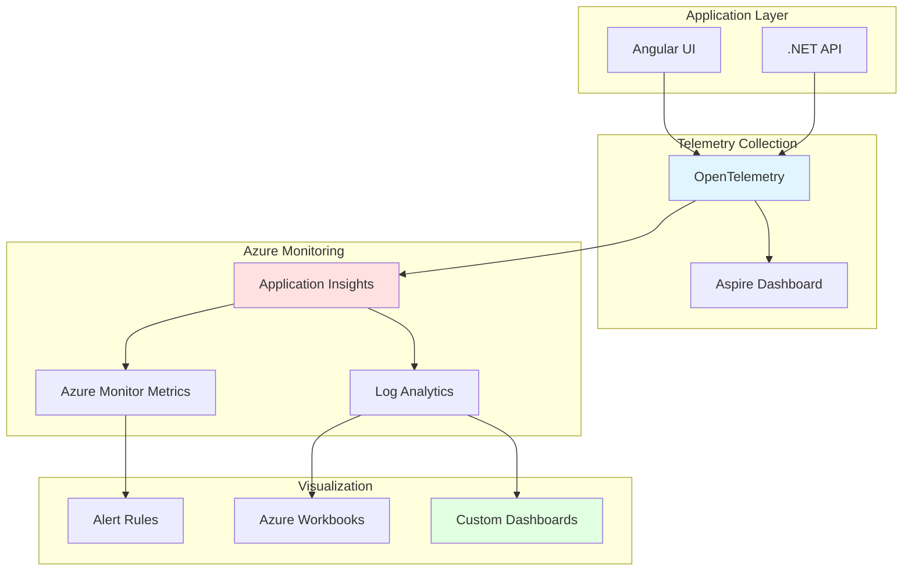

# Zava Travel Agents - Architecture Documentation

## Overview

Zava Travel Agents is a modern, cloud-ready travel planning application built with .NET Aspire orchestration, featuring an Angular frontend and a .NET backend powered by Azure AI agents.

## High-Level Architecture



## Component Architecture



## Deployment Architecture



## Data Flow Architecture



## ASCII Architecture Diagram

```
┌─────────────────────────────────────────────────────────────────────┐
│                        Zava Travel Agents                            │
│                     Cloud-Native Architecture                        │
└─────────────────────────────────────────────────────────────────────┘

┌─────────────────────────────────────────────────────────────────────┐
│                         USER LAYER                                   │
│                                                                       │
│   ┌─────────────┐                                                    │
│   │   Browser   │  ← User Interacts                                 │
│   └──────┬──────┘                                                    │
│          │                                                            │
└──────────┼────────────────────────────────────────────────────────-─┘
           │
           │ HTTPS
           │
┌──────────▼────────────────────────────────────────────────────────-─┐
│                      FRONTEND LAYER                                  │
│                                                                       │
│   ┌───────────────────────────────────────────┐                     │
│   │         Angular 19 UI (Port 4200)         │                     │
│   ├───────────────────────────────────────────┤                     │
│   │  ┌──────────────┐   ┌──────────────────┐ │                     │
│   │  │  Landing     │   │   Promotions     │ │                     │
│   │  │  Page        │   │   Carousel       │ │                     │
│   │  └──────────────┘   └──────────────────┘ │                     │
│   │  ┌──────────────────────────────────────┐│                     │
│   │  │    Floating Chat Window              ││                     │
│   │  │  (Bottom-Right, 400x600px)          ││                     │
│   │  └──────────────────────────────────────┘│                     │
│   └────────────────────┬──────────────────────┘                     │
│                        │                                              │
└────────────────────────┼──────────────────────────────────────────-─┘
                         │
                         │ REST API
                         │
┌────────────────────────▼──────────────────────────────────────────-─┐
│                      BACKEND LAYER                                   │
│                                                                       │
│   ┌───────────────────────────────────────────┐                     │
│   │      .NET 10 Web API (Port 5292)          │                     │
│   ├───────────────────────────────────────────┤                     │
│   │  Endpoints:                                │                     │
│   │  • POST /api/agents/chat                  │                     │
│   │  • GET  /api/agents/capabilities          │                     │
│   │  • POST /api/agents/analyze               │                     │
│   │  • GET  /health                           │                     │
│   └────────────────────┬──────────────────────┘                     │
│                        │                                              │
│   ┌────────────────────▼──────────────────────┐                     │
│   │      Azure Agent Service                  │                     │
│   ├───────────────────────────────────────────┤                     │
│   │  • Thread-Safe Session Management         │                     │
│   │  • Intent Classification                  │                     │
│   │  • Entity Extraction                      │                     │
│   │  • Dual-Mode Operation                    │                     │
│   └────────┬───────────────────┬───────────────┘                     │
│            │                   │                                      │
└────────────┼───────────────────┼──────────────────────────────────-─┘
             │                   │
             │ Connected         │ Mock
             │ Mode              │ Mode
             │                   │
┌────────────▼───────────────────▼──────────────────────────────────-─┐
│                   INTEGRATION LAYER                                  │
│                                                                       │
│   ┌─────────────────────────┐   ┌─────────────────────────┐        │
│   │  Azure AI Projects SDK  │   │   Mock Response         │        │
│   │  (v1.2.0-beta.5)       │   │   Generator             │        │
│   └──────────┬──────────────┘   └─────────────────────────┘        │
│              │                                                        │
└──────────────┼────────────────────────────────────────────────────-─┘
               │
               │ Azure SDK
               │
┌──────────────▼────────────────────────────────────────────────────-─┐
│                      AZURE CLOUD                                     │
│                                                                       │
│   ┌───────────────────────────────────────────┐                     │
│   │      Azure AI Foundry                     │                     │
│   │      ┌──────────────────────────┐         │                     │
│   │      │  AI Agent                │         │                     │
│   │      │  • GPT-4o / GPT-4        │         │                     │
│   │      │  • Thread Management     │         │                     │
│   │      │  • Tool Calling          │         │                     │
│   │      └──────────────────────────┘         │                     │
│   └───────────────────────────────────────────┘                     │
│                                                                       │
│   ┌───────────────────────────────────────────┐                     │
│   │      Azure Container Apps                 │                     │
│   │      • UI Container                       │                     │
│   │      • API Container                      │                     │
│   │      • Auto-scaling                       │                     │
│   └───────────────────────────────────────────┘                     │
│                                                                       │
│   ┌───────────────────────────────────────────┐                     │
│   │      Application Insights                 │                     │
│   │      • Distributed Tracing                │                     │
│   │      • Metrics & Logs                     │                     │
│   └───────────────────────────────────────────┘                     │
│                                                                       │
└─────────────────────────────────────────────────────────────────────┘

┌─────────────────────────────────────────────────────────────────────┐
│                    ORCHESTRATION LAYER                               │
│                                                                       │
│   ┌───────────────────────────────────────────┐                     │
│   │      .NET Aspire AppHost                  │                     │
│   │      • Service Discovery                  │                     │
│   │      • Health Monitoring                  │                     │
│   │      • Distributed Tracing                │                     │
│   │      • Configuration Management           │                     │
│   └───────────────────────────────────────────┘                     │
│                                                                       │
│   ┌───────────────────────────────────────────┐                     │
│   │      Aspire Dashboard                     │                     │
│   │      • Real-time Logs                     │                     │
│   │      • Service Status                     │                     │
│   │      • Resource Monitoring                │                     │
│   └───────────────────────────────────────────┘                     │
│                                                                       │
└─────────────────────────────────────────────────────────────────────┘
```

## Technology Stack

### Frontend
- **Framework**: Angular 19
- **UI Components**: Spartan UI
- **Carousel**: embla-carousel-angular 19.0.0
- **Styling**: Tailwind CSS 3.4
- **Language**: TypeScript 5.7
- **Build**: Angular CLI 19.2

### Backend
- **Framework**: .NET 10.0
- **API Style**: ASP.NET Core Minimal APIs
- **AI Integration**: Azure.AI.Projects v1.2.0-beta.5
- **Authentication**: Azure Identity
- **Language**: C# 13

### Orchestration
- **.NET Aspire**: v13.1.0
- **Service Discovery**: Built-in
- **Telemetry**: OpenTelemetry
- **Monitoring**: Aspire Dashboard

### Cloud Infrastructure
- **Hosting**: Azure Container Apps
- **AI**: Azure AI Foundry
- **Monitoring**: Application Insights
- **Registry**: Azure Container Registry
- **Deployment**: Azure Developer CLI (azd)

## Security Architecture



## Scalability Architecture



## Network Architecture

```
┌─────────────────────────────────────────────────────────────┐
│                    Internet                                  │
└───────────────────────┬─────────────────────────────────────┘
                        │
                        │ HTTPS (443)
                        │
┌───────────────────────▼─────────────────────────────────────┐
│              Azure Front Door (Optional)                     │
│              • CDN                                           │
│              • WAF                                           │
│              • SSL/TLS Termination                          │
└───────────────────────┬─────────────────────────────────────┘
                        │
        ┌───────────────┴────────────────┐
        │                                 │
┌───────▼───────┐              ┌─────────▼────────┐
│  UI Container │              │  API Container   │
│  App          │              │  App             │
│  (Public)     │─────────────▶│  (Internal)      │
│  Port 80/443  │  HTTP/REST   │  Port 8080       │
└───────────────┘              └─────────┬────────┘
                                         │
                                         │ Azure SDK
                                         │
                              ┌──────────▼─────────┐
                              │  Azure AI Foundry  │
                              │  (Internal VNet)   │
                              └────────────────────┘
```

## Performance Characteristics

| Component | Expected Latency | Throughput | Scaling Strategy |
|-----------|-----------------|------------|------------------|
| UI Load | < 2s | N/A | CDN + Static hosting |
| API Health Check | < 100ms | 1000 req/s | Horizontal auto-scaling |
| Chat API (Mock) | < 200ms | 500 req/s | Stateless, horizontal |
| Chat API (Azure AI) | 2-5s | 100 req/s | Async processing |
| Carousel Load | < 500ms | N/A | Image CDN |

## Monitoring & Observability



## Key Features

### Frontend Features
- **Responsive Design**: Mobile-first approach with Tailwind CSS
- **Component-Based**: Modular Angular components
- **Real-time Updates**: Signal-based reactivity
- **Smooth Animations**: CSS transitions and animations
- **Lazy Loading**: Route-based code splitting

### Backend Features
- **Dual-Mode Operation**: Azure AI or Mock mode
- **Thread-Safe**: Concurrent collections throughout
- **Memory-Bounded**: 50-message session limit
- **Intent Classification**: NLP-based understanding
- **Entity Extraction**: Destination recognition
- **Health Checks**: Built-in endpoints

### Aspire Features
- **Service Orchestration**: Unified lifecycle management
- **Service Discovery**: Automatic endpoint resolution
- **Distributed Tracing**: End-to-end request tracking
- **Real-time Logs**: Aggregated log viewing
- **Resource Monitoring**: CPU, memory, network metrics
- **Development Dashboard**: Local debugging interface

## Configuration

### Environment Variables

```bash
# Backend Configuration
ASPNETCORE_ENVIRONMENT=Production
AzureAI__ConnectionString=<your-connection-string>
AzureAI__AgentId=<your-agent-id>
APPLICATIONINSIGHTS_CONNECTION_STRING=<your-app-insights>

# Frontend Configuration
API_URL=https://api.yourdomain.com
```

### Ports

| Service | Port | Protocol | Access |
|---------|------|----------|--------|
| Angular UI | 4200 | HTTP | Public |
| .NET API | 5292 | HTTP | Internal |
| Aspire Dashboard | 15XXX | HTTP | Local only |
| Production UI | 80/443 | HTTPS | Public |
| Production API | 8080 | HTTP | Internal |

## References

- [.NET Aspire Documentation](https://learn.microsoft.com/dotnet/aspire/)
- [Azure AI Projects SDK](https://learn.microsoft.com/azure/ai-studio/)
- [Angular Documentation](https://angular.dev/)
- [Azure Container Apps](https://learn.microsoft.com/azure/container-apps/)
