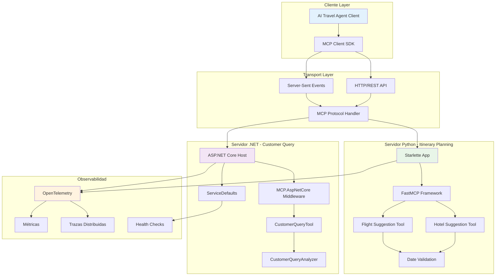
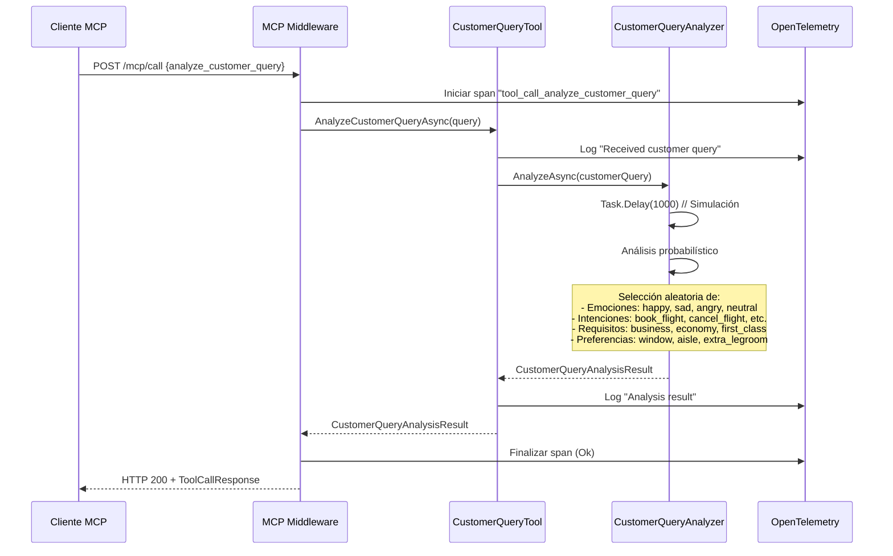
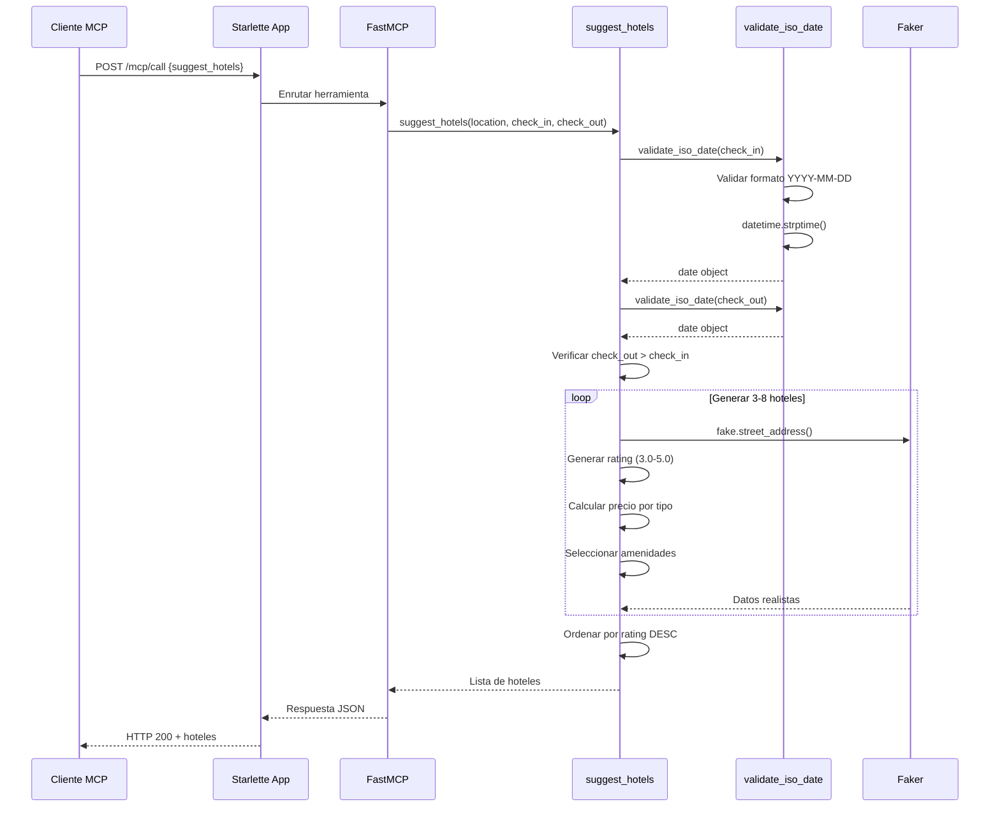
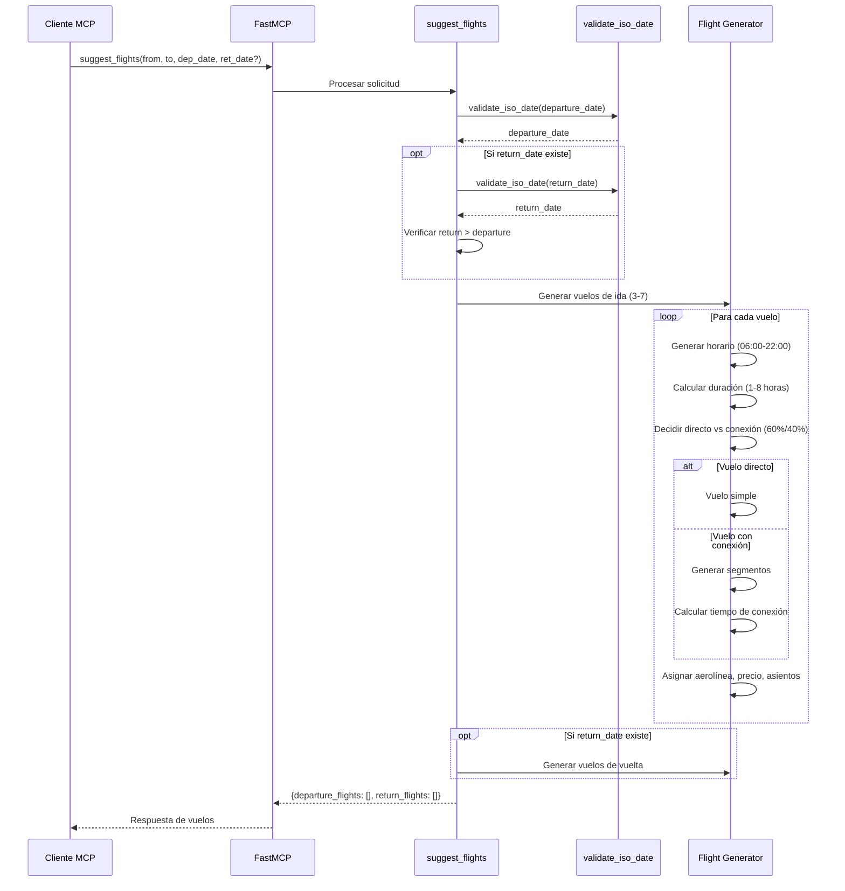
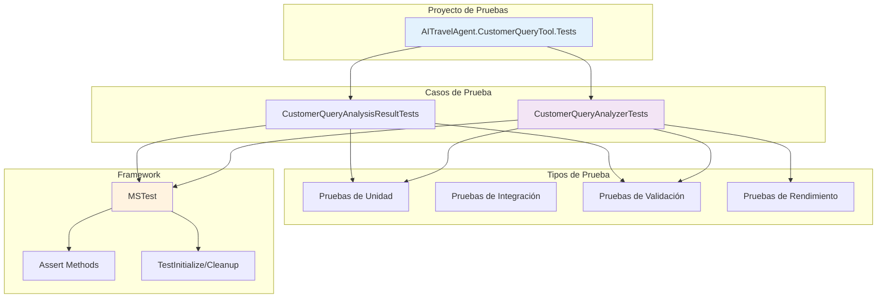
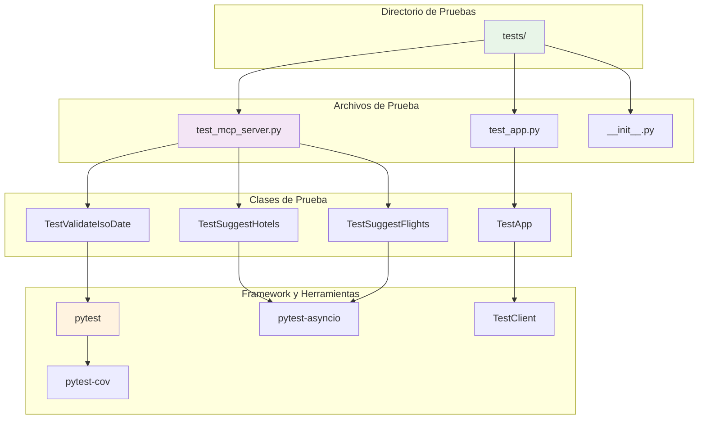
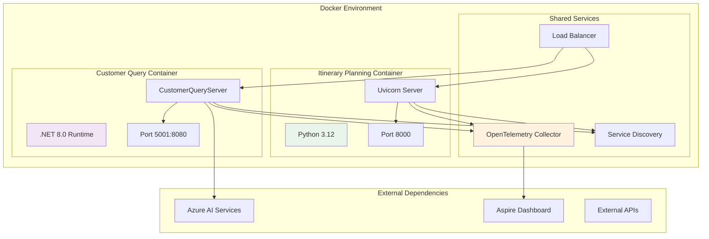
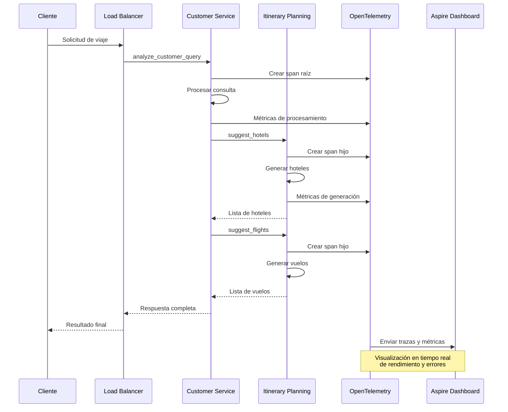
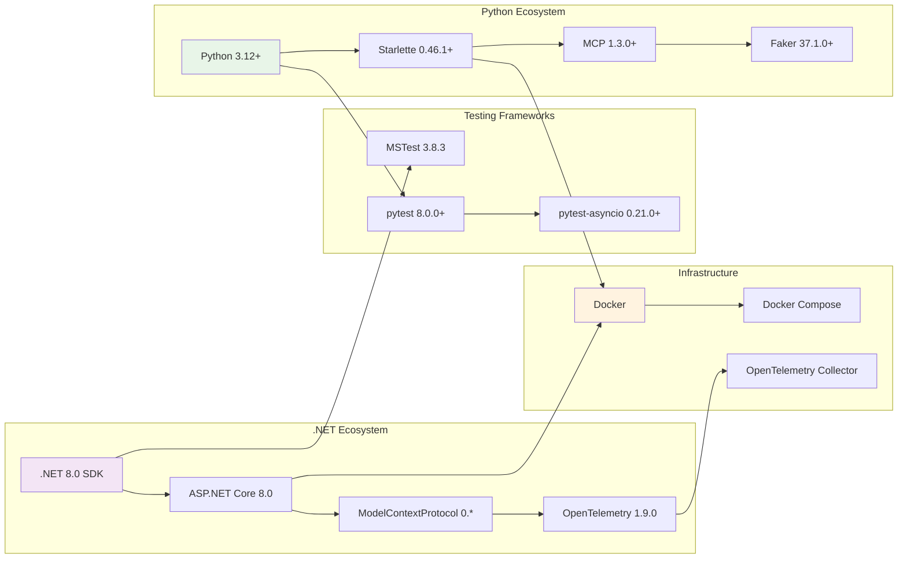

# Diagramas de Arquitectura MCP - Contoso Travel Agents

Este documento complementa la documentación principal con diagramas detallados de la arquitectura de los servidores MCP.

## Arquitectura Detallada del Sistema MCP

### Vista General de Componentes

## Flujo de Datos del Customer Query (.NET)

### Procesamiento de Consulta de Cliente

## Flujo de Datos del Itinerary Planning (Python)

### Sugerencia de Hoteles

### Sugerencia de Vuelos

## Arquitectura de Pruebas

### Estructura de Pruebas .NET

### Estructura de Pruebas Python

## Diagrama de Despliegue

### Contenedorización y Orquestación

## Flujo de Observabilidad

### Trazas Distribuidas

## Matriz de Compatibilidad

### Versiones y Dependencias

---

**Nota**: Estos diagramas representan la arquitectura actual implementada y validada mediante las pruebas unitarias desarrolladas. Para actualizaciones o modificaciones, consulte la documentación principal en `README.md`.