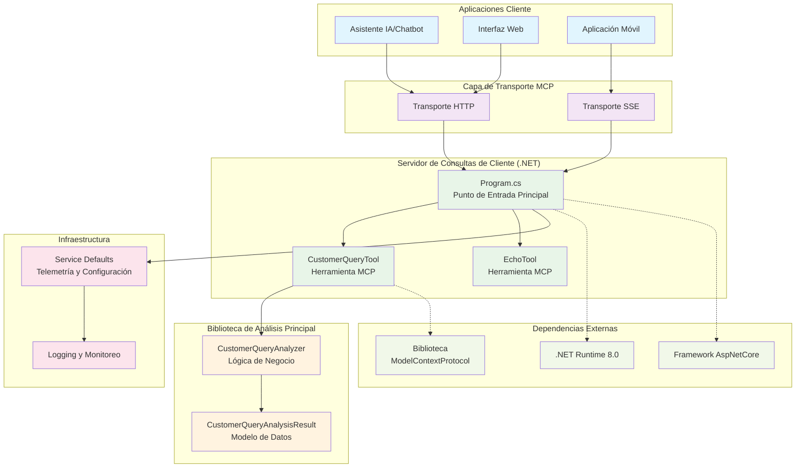

# Análisis de Consultas de Clientes - Herramientas MCP .NET

## Resumen

Este documento describe la implementación de las Herramientas MCP (Protocolo de Contexto de Modelo) para el Análisis de Consultas de Clientes del sistema Contoso Travel Agents. Esta solución basada en .NET proporciona análisis inteligente de consultas de clientes para extraer emociones, intenciones, requisitos y preferencias.

## Funcionalidad

La herramienta de Análisis de Consultas de Clientes sirve como una capa inteligente entre las interacciones de los clientes y el sistema de agentes de viaje. Procesa consultas de clientes en lenguaje natural y extrae información estructurada que puede utilizarse para proporcionar asistencia mejor y más específica.

### Características Principales

- **Detección de Emociones**: Identifica el estado emocional de los clientes a partir de sus consultas (feliz, triste, enojado, neutral)
- **Clasificación de Intenciones**: Determina lo que el cliente quiere lograr (reservar_vuelo, cancelar_vuelo, cambiar_vuelo, consultar, queja)
- **Extracción de Requisitos**: Identifica preferencias de clase de viaje (business, economy, first_class)
- **Análisis de Preferencias**: Extrae preferencias de asientos y servicios (ventana, pasillo, espacio_extra_piernas)

## Herramientas MCP Publicadas

### 1. CustomerQueryTool - analyze_customer_query

**Nombre**: `analyze_customer_query`  
**Título**: `Analizar Consulta de Cliente`  
**Descripción**: Analiza la consulta del cliente y proporciona una respuesta con información estructurada.

**Parámetros**:
- `customerQuery` (string): El texto de la consulta del cliente a analizar

**Retorna**: Objeto `CustomerQueryAnalysisResult` que contiene:
- `CustomerQuery`: El texto de la consulta original
- `Emotion`: Estado emocional detectado
- `Intent`: Intención principal del cliente
- `Requirements`: Requisitos de clase de viaje
- `Preferences`: Preferencias de asientos y servicios

### 2. EchoTool - echo

**Nombre**: `echo`  
**Título**: `Herramienta Echo`  
**Descripción**: Herramienta echo simple para probar conectividad y funcionalidad básica.

**Parámetros**:
- `message` (string): Mensaje a devolver como eco

**Retorna**: String con "hello from .NET: {message}"

## Diagrama de Arquitectura



## Estructura del Proyecto

```
src/tools/customer-query/
├── AITravelAgent.sln                          # Archivo de solución
├── AITravelAgent.CustomerQueryServer/         # Hosting del servidor MCP
│   ├── Program.cs                            # Punto de entrada del servidor
│   ├── Tools/
│   │   ├── CustomerQueryTool.cs              # Herramienta principal de análisis
│   │   └── EchoTool.cs                       # Herramienta echo simple
│   └── AITravelAgent.CustomerQueryServer.csproj
├── AITravelAgent.CustomerQueryTool/           # Biblioteca principal de análisis
│   ├── CustomerQueryAnalyzer.cs              # Lógica de análisis
│   ├── CustomerQueryAnalysisResult.cs        # Modelo de datos de resultado
│   └── AITravelAgent.CustomerQueryTool.csproj
├── AITravelAgent.CustomerQueryTool.Tests/     # Pruebas unitarias
│   ├── Test1.cs                              # Suite completa de pruebas
│   └── AITravelAgent.CustomerQueryTool.Tests.csproj
└── AITravelAgent.ServiceDefaults/             # Servicios compartidos
    ├── Extensions.cs                         # Configuración de servicios
    └── AITravelAgent.ServiceDefaults.csproj
```

## Documentación de Componentes Externos

### .NET 8.0 Runtime
- **Propósito**: Entorno de ejecución base para la aplicación
- **Versión**: 8.0.x
- **Documentación**: [Documentación de Microsoft .NET](https://docs.microsoft.com/es-es/dotnet/)
- **Características Principales**: 
  - Compatibilidad multiplataforma
  - Operaciones async de alto rendimiento
  - Inyección de dependencias integrada

### Biblioteca ModelContextProtocol
- **Propósito**: Habilita la funcionalidad del servidor MCP y registro de herramientas
- **Paquete**: `ModelContextProtocol` y `ModelContextProtocol.AspNetCore`
- **Documentación**: [Especificación del Protocolo MCP](https://modelcontextprotocol.io/)
- **Características Principales**:
  - Descubrimiento y registro automático de herramientas
  - Soporte para transporte HTTP y SSE
  - Definiciones de herramientas type-safe

### Framework ASP.NET Core
- **Propósito**: Framework web para hospedar el servidor MCP
- **Versión**: 8.0.x
- **Documentación**: [Documentación de ASP.NET Core](https://docs.microsoft.com/es-es/aspnet/core/)
- **Características Principales**:
  - Servidor HTTP integrado (Kestrel)
  - Pipeline de middleware
  - Gestión de configuración

### Framework MSTest
- **Propósito**: Framework de pruebas unitarias para aplicaciones .NET
- **Paquete**: `MSTest.Sdk`
- **Versión**: 3.8.3
- **Documentación**: [Documentación de MSTest](https://docs.microsoft.com/es-es/dotnet/core/testing/unit-testing-with-mstest)
- **Características Principales**:
  - Definiciones de pruebas basadas en atributos
  - Gestión del ciclo de vida de pruebas
  - Métodos Assert para validación

## Configuración y Despliegue

### Requisitos del Entorno
- .NET 8.0 Runtime o SDK
- Soporte para Windows, Linux o macOS
- Mínimo 512MB de RAM
- Acceso de red para comunicación HTTP/SSE

### Instrucciones de Construcción y Ejecución

1. **Construir la solución**:
   ```bash
   dotnet build
   ```

2. **Ejecutar pruebas**:
   ```bash
   dotnet test
   ```

3. **Iniciar el servidor**:
   ```bash
   dotnet run --project AITravelAgent.CustomerQueryServer
   ```

### Opciones de Configuración
- Configuración de puerto vía `appsettings.json`
- Niveles y destinos de logging
- Endpoints de descubrimiento de servicios
- Configuraciones de telemetría y monitoreo

## Ejemplos de Uso

### Análisis Básico de Consulta
```json
{
  "tool": "analyze_customer_query",
  "parameters": {
    "customerQuery": "Estoy frustrado y necesito cancelar mi vuelo de clase business a París"
  }
}
```

**Respuesta Esperada**:
```json
{
  "customerQuery": "Estoy frustrado y necesito cancelar mi vuelo de clase business a París",
  "emotion": "angry",
  "intent": "cancel_flight",
  "requirements": "business",
  "preferences": "window"
}
```

### Prueba de Herramienta Echo
```json
{
  "tool": "echo",
  "parameters": {
    "message": "Hola Servidor MCP"
  }
}
```

**Respuesta Esperada**:
```
"hello from .NET: Hola Servidor MCP"
```

## Características de Rendimiento

- **Tiempo de Respuesta**: ~1 segundo por análisis (incluye retraso de procesamiento simulado)
- **Throughput**: Diseñado para manejo de solicitudes concurrentes vía async/await
- **Uso de Memoria**: Huella de memoria baja con asignaciones mínimas
- **Escalabilidad**: Escalado horizontal soportado vía balanceeo de carga

## Consideraciones de Seguridad

- Validación de entrada para todas las consultas de clientes
- Sanitización de contenido proporcionado por el usuario
- Comunicación segura vía HTTPS (configurable)
- Sin almacenamiento persistente de datos sensibles de clientes
- Controles de logging para prevenir exposición de datos sensibles

## Mejoras Futuras

- Integración con modelos reales de IA/ML para análisis de sentimientos
- Soporte para múltiples idiomas
- Análisis de patrones de consultas históricas
- Clasificación mejorada de emociones con puntuaciones de confianza
- Capacidades de monitoreo y alertas en tiempo real