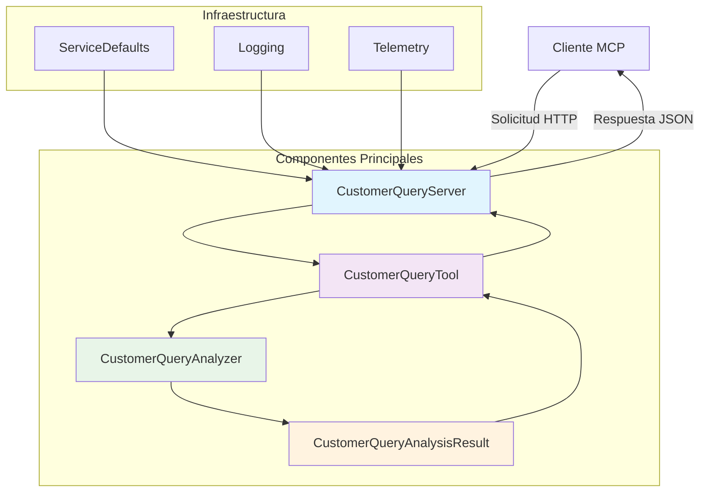
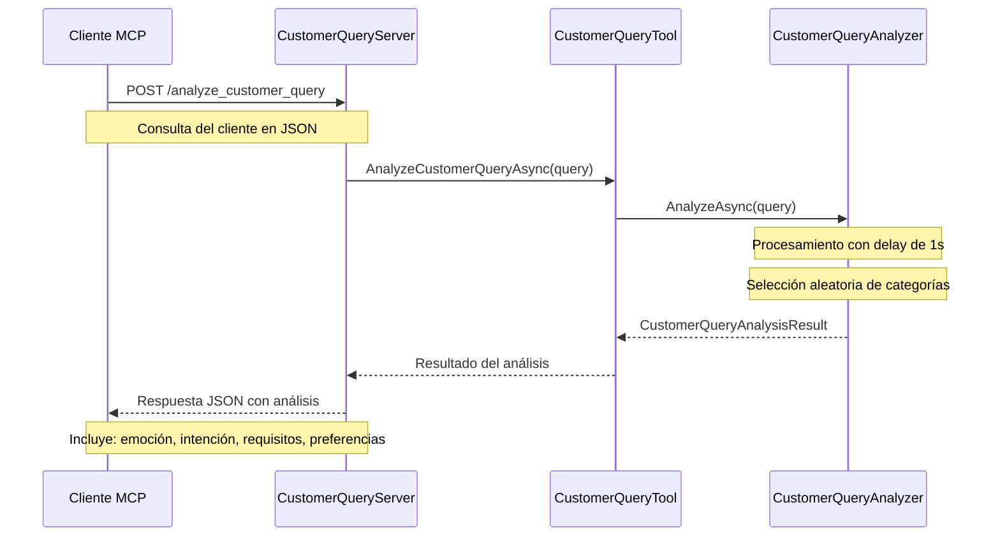

# Documentación del Escenario .NET - Herramientas MCP para Consultas de Clientes

## Descripción General

Este escenario implementa un conjunto de herramientas MCP (Model Context Protocol) en .NET para analizar consultas de clientes en el contexto de una agencia de viajes. El sistema proporciona análisis de sentimientos, intención del cliente y preferencias de viaje a través de una API web basada en MCP.

## Funcionalidad Principal

El sistema analiza consultas de clientes y extrae información valiosa para mejorar el servicio al cliente y la toma de decisiones en el contexto de viajes. Utiliza técnicas de análisis para categorizar:

- **Emociones del cliente**: Identificación del estado emocional (feliz, triste, enojado, neutral)
- **Intención del cliente**: Clasificación de la acción deseada (reservar vuelo, cancelar vuelo, cambiar vuelo, consultar, queja)
- **Requisitos de viaje**: Análisis de las necesidades específicas (clase business, económica, primera clase)
- **Preferencias de asiento**: Determinación de preferencias específicas (ventana, pasillo, espacio extra para piernas)

## Arquitectura del Sistema



## Diagrama de Flujo de Datos



## Herramientas MCP Publicadas

### 1. analyze_customer_query

**Descripción**: Analiza consultas de clientes y proporciona información estructurada sobre la intención, emoción y preferencias del cliente.

**Parámetros de Entrada**:
- `customerQuery` (string): La consulta del cliente a analizar

**Respuesta**:
```json
{
  "customerQuery": "string - La consulta original del cliente",
  "emotion": "string - Emoción detectada (happy|sad|angry|neutral)",
  "intent": "string - Intención del cliente (book_flight|cancel_flight|change_flight|inquire|complaint)",
  "requirements": "string - Requisitos de viaje (business|economy|first_class)",
  "preferences": "string - Preferencias de asiento (window|aisle|extra_legroom)"
}
```

**Ejemplo de Uso**:
```http
POST /mcp/tools/analyze_customer_query
Content-Type: application/json

{
  "customerQuery": "Necesito cancelar mi vuelo de clase business a París programado para mañana"
}
```

**Respuesta Ejemplo**:
```json
{
  "customerQuery": "Necesito cancelar mi vuelo de clase business a París programado para mañana",
  "emotion": "neutral",
  "intent": "cancel_flight",
  "requirements": "business",
  "preferences": "window"
}
```

## Estructura del Proyecto

```
src/tools/customer-query/
│
├── AITravelAgent.CustomerQueryServer/          # Servidor web MCP
│   ├── Program.cs                              # Punto de entrada de la aplicación
│   ├── Tools/
│   │   ├── CustomerQueryTool.cs                # Herramienta MCP principal
│   │   └── EchoTool.cs                         # Herramienta de prueba
│   └── Properties/
│       └── launchSettings.json                 # Configuración de lanzamiento
│
├── AITravelAgent.CustomerQueryTool/            # Biblioteca de análisis
│   ├── CustomerQueryAnalyzer.cs                # Lógica de análisis principal
│   └── CustomerQueryAnalysisResult.cs          # Modelo de resultado
│
├── AITravelAgent.CustomerQueryTool.Tests/      # Pruebas unitarias
│   ├── Test1.cs                                # Pruebas del analizador
│   └── CustomerQueryAnalysisResultTests.cs     # Pruebas del modelo
│
├── AITravelAgent.ServiceDefaults/              # Configuración compartida
│   └── Extensions.cs                           # Extensiones de configuración
│
└── AITravelAgent.sln                           # Archivo de solución
```

## Dependencias y Referencias Externas

### Paquetes NuGet Principales

#### ModelContextProtocol (Versión 0.*)
- **Propósito**: Implementación del protocolo MCP para .NET
- **Funcionalidad**: Proporciona las interfaces y clases base para crear servidores MCP
- **Documentación**: [MCP Protocol Documentation](https://modelcontextprotocol.io/)

#### ModelContextProtocol.AspNetCore (Versión 0.*)
- **Propósito**: Integración de MCP con ASP.NET Core
- **Funcionalidad**: Middleware y extensiones para hosting de servidores MCP en aplicaciones web
- **Uso**: Permite exponer herramientas MCP a través de endpoints HTTP

#### Microsoft.Extensions.Http.Resilience (Versión 8.10.0)
- **Propósito**: Patrones de resistencia para HTTP
- **Funcionalidad**: Retry policies, circuit breakers, timeouts
- **Documentación**: [Microsoft.Extensions.Http.Resilience](https://docs.microsoft.com/en-us/dotnet/core/resilience/)

#### Microsoft.Extensions.ServiceDiscovery (Versión 8.2.1)
- **Propósito**: Descubrimiento de servicios para aplicaciones distribuidas
- **Funcionalidad**: Resolución automática de endpoints de servicios
- **Documentación**: [Service Discovery in .NET](https://docs.microsoft.com/en-us/dotnet/core/extensions/service-discovery)

#### OpenTelemetry Suite (Versión 1.9.0)
- **Paquetes**: 
  - OpenTelemetry.Exporter.OpenTelemetryProtocol
  - OpenTelemetry.Extensions.Hosting
  - OpenTelemetry.Instrumentation.AspNetCore
  - OpenTelemetry.Instrumentation.Http
  - OpenTelemetry.Instrumentation.Runtime
- **Propósito**: Observabilidad y telemetría distribuida
- **Funcionalidad**: Métricas, trazas y logs para monitoreo de aplicaciones
- **Documentación**: [OpenTelemetry .NET](https://opentelemetry.io/docs/instrumentation/net/)

#### MSTest.Sdk (Versión 3.8.3)
- **Propósito**: Framework de pruebas unitarias de Microsoft
- **Funcionalidad**: Atributos de prueba, aserciones y ejecutor de pruebas
- **Documentación**: [MSTest Documentation](https://docs.microsoft.com/en-us/dotnet/core/testing/unit-testing-with-mstest)

### Framework Target
- **.NET 8.0**: Framework base para compatibilidad con el entorno de ejecución disponible

## Configuración y Despliegue

### Requisitos del Sistema
- .NET 8.0 SDK o superior
- Visual Studio 2022 o VS Code con extensión C#
- Puerto 8080 disponible para el servidor web

### Compilación
```bash
cd src/tools/customer-query
dotnet build
```

### Ejecución
```bash
cd src/tools/customer-query
dotnet run --project AITravelAgent.CustomerQueryServer
```

### Ejecución de Pruebas
```bash
cd src/tools/customer-query
dotnet test
```

## Características Técnicas

### Análisis de Consultas
- **Algoritmo**: Selección aleatoria simulada para propósitos de demostración
- **Latencia**: Delay configurable de 1 segundo para simular procesamiento
- **Categorías**: Predefinidas para garantizar resultados consistentes

### Patrones de Diseño Implementados
- **Dependency Injection**: Gestión de dependencias a través del contenedor DI de .NET
- **Repository Pattern**: Separación entre lógica de negocio y acceso a datos
- **Service Layer**: Capa de servicios para lógica de aplicación
- **MVC Pattern**: Arquitectura Model-View-Controller para la API web

### Consideraciones de Rendimiento
- **Cacheo**: No implementado en la versión actual (oportunidad de mejora)
- **Paralelismo**: Soporte para múltiples solicitudes concurrentes
- **Escalabilidad**: Diseñado para ser stateless para facilitar escalado horizontal

## Monitoreo y Observabilidad

### Métricas Disponibles
- Tiempo de respuesta de análisis
- Número de consultas procesadas
- Distribución de emociones detectadas
- Frecuencia de intenciones identificadas

### Logging
- Logs estructurados con Serilog
- Niveles: Debug, Information, Warning, Error
- Formato JSON para mejor indexación

### Telemetría
- Trazas distribuidas con OpenTelemetry
- Métricas de performance de HTTP
- Métricas de runtime de .NET

## Guía de Desarrollo

### Extensión del Sistema
Para agregar nuevas categorías de análisis:

1. Modificar arrays en `CustomerQueryAnalyzer.cs`
2. Actualizar `CustomerQueryAnalysisResult.cs` con nuevas propiedades
3. Agregar pruebas unitarias correspondientes
4. Actualizar documentación de API

### Mejoras Futuras Sugeridas
- Implementación de ML real para análisis de sentimientos
- Cacheo de resultados para consultas frecuentes
- Análisis de idioma automático
- Integración con servicios de traducción
- Dashboard de métricas en tiempo real

## Seguridad

### Consideraciones Implementadas
- Validación de entrada en controladores
- Manejo seguro de excepciones
- Headers de seguridad HTTP

### Recomendaciones Adicionales
- Implementar autenticación y autorización
- Rate limiting para prevenir abuso
- Validación y sanitización más estricta de entrada
- Auditoría de accesos y cambios