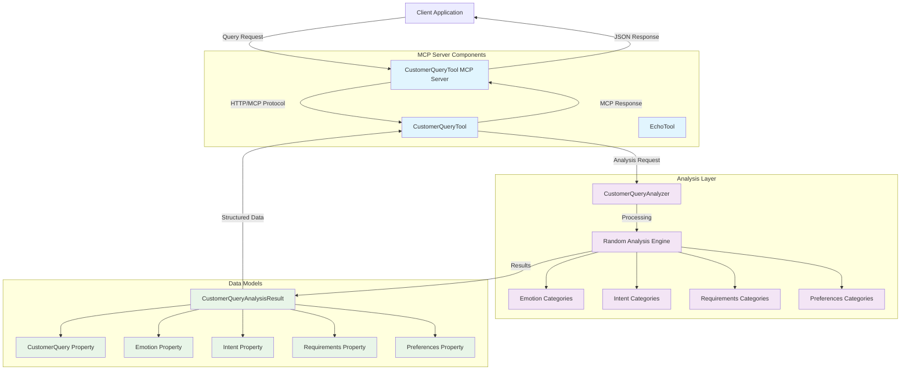

# Customer Query MCP Tools - Documentation

## Overview

The Customer Query MCP Tools provide intelligent analysis capabilities for customer queries in the travel domain. This .NET-based solution implements Model Context Protocol (MCP) tools that can analyze customer messages to extract emotional sentiment, intent, requirements, and preferences.

## Functionality

### Core Components

#### 1. CustomerQueryAnalyzer
The main analysis engine that processes customer queries and returns structured analysis results.

**Features:**
- **Emotion Detection**: Identifies customer emotional state (happy, sad, angry, neutral)
- **Intent Recognition**: Determines customer intent (book_flight, cancel_flight, change_flight, inquire, complaint)
- **Requirements Extraction**: Identifies service class preferences (business, economy, first_class)
- **Preference Analysis**: Detects seating preferences (window, aisle, extra_legroom)

#### 2. CustomerQueryAnalysisResult
Data structure that encapsulates the analysis results with the following properties:
- `CustomerQuery`: Original customer message
- `Emotion`: Detected emotional state
- `Intent`: Identified customer intent
- `Requirements`: Extracted service requirements
- `Preferences`: Identified customer preferences

### MCP Tools Published

#### analyze_customer_query
**Description**: Analyzes customer queries and provides structured insights into customer sentiment, intent, and preferences.

**Parameters:**
- `customerQuery` (string): The customer message to analyze

**Returns:**
- `CustomerQueryAnalysisResult`: Structured analysis containing emotion, intent, requirements, and preferences

**Usage Example:**
```json
{
  "tool": "analyze_customer_query",
  "arguments": {
    "customerQuery": "I'm very upset about my delayed flight booking!"
  }
}
```

**Response:**
```json
{
  "customerQuery": "I'm very upset about my delayed flight booking!",
  "emotion": "angry",
  "intent": "complaint",
  "requirements": "economy",
  "preferences": "window"
}
```

## Architecture Diagram



## External Components and Dependencies

### Framework Dependencies

#### Microsoft.NET.Sdk
- **Version**: 8.0+ (originally targets .NET 9.0)
- **Purpose**: Core .NET SDK for building and running the application
- **Documentation**: [Microsoft .NET Documentation](https://docs.microsoft.com/en-us/dotnet/)

#### Microsoft.NET.Sdk.Web  
- **Purpose**: Web development SDK for ASP.NET Core applications
- **Used for**: HTTP server hosting and web API functionality

### MCP (Model Context Protocol) Dependencies

#### ModelContextProtocol
- **Version**: 0.*-* (latest pre-release)
- **Purpose**: Core MCP protocol implementation
- **Functionality**: Provides the foundational MCP server capabilities
- **Repository**: [Model Context Protocol](https://github.com/modelcontextprotocol)

#### ModelContextProtocol.AspNetCore
- **Version**: 0.*-* (latest pre-release)  
- **Purpose**: ASP.NET Core integration for MCP
- **Functionality**: 
  - HTTP transport support
  - Middleware integration
  - Endpoint mapping
  - Service registration

### Testing Dependencies

#### MSTest.Sdk
- **Version**: 3.8.3
- **Purpose**: Microsoft's testing framework for .NET
- **Features**:
  - Unit test execution
  - Test discovery and execution
  - Assert methods
  - Test lifecycle management

### Service Dependencies

#### Microsoft.Extensions.ServiceDiscovery
- **Version**: 9.1.0
- **Purpose**: Service discovery for distributed applications
- **Documentation**: [Service Discovery in .NET](https://docs.microsoft.com/en-us/dotnet/core/extensions/service-discovery)

#### Microsoft.Extensions.Http.Resilience
- **Version**: 9.2.0
- **Purpose**: HTTP resilience patterns (retry, circuit breaker, timeout)
- **Documentation**: [HTTP resilience in .NET](https://docs.microsoft.com/en-us/dotnet/core/resilience/)

### Observability Dependencies

#### OpenTelemetry.Extensions.Hosting
- **Version**: 1.9.0
- **Purpose**: Hosting integration for OpenTelemetry
- **Documentation**: [OpenTelemetry .NET](https://opentelemetry.io/docs/instrumentation/net/)

#### OpenTelemetry.Instrumentation.AspNetCore
- **Version**: 1.9.0  
- **Purpose**: ASP.NET Core instrumentation for telemetry

#### OpenTelemetry.Instrumentation.Http
- **Version**: 1.9.0
- **Purpose**: HTTP client instrumentation

#### OpenTelemetry.Instrumentation.Runtime
- **Version**: 1.9.0
- **Purpose**: .NET runtime instrumentation

#### OpenTelemetry.Exporter.OpenTelemetryProtocol
- **Version**: 1.9.0
- **Purpose**: OTLP exporter for telemetry data

## Project Structure

```
src/tools/customer-query/
├── AITravelAgent.CustomerQueryServer/          # MCP Server Application
│   ├── Program.cs                              # Application entry point
│   ├── Tools/
│   │   ├── CustomerQueryTool.cs                # MCP tool implementation
│   │   └── EchoTool.cs                         # Additional echo tool
│   └── AITravelAgent.CustomerQueryServer.csproj
├── AITravelAgent.CustomerQueryTool/            # Core Analysis Library
│   ├── CustomerQueryAnalyzer.cs                # Main analysis logic
│   ├── CustomerQueryAnalysisResult.cs          # Result data model
│   └── AITravelAgent.CustomerQueryTool.csproj
├── AITravelAgent.CustomerQueryTool.Tests/      # Unit Tests
│   ├── Test1.cs                                # CustomerQueryAnalyzer tests
│   ├── CustomerQueryAnalysisResultTests.cs     # Result model tests
│   └── AITravelAgent.CustomerQueryTool.Tests.csproj
├── AITravelAgent.ServiceDefaults/              # Shared Service Configuration
│   ├── Extensions.cs                           # Service extensions
│   └── AITravelAgent.ServiceDefaults.csproj
├── AITravelAgent.sln                           # Solution file
└── Dockerfile                                  # Container configuration
```

## Configuration and Deployment

### Environment Requirements
- .NET 8.0+ SDK
- Visual Studio 2022 or compatible IDE
- Docker (optional, for containerized deployment)

### Building the Project
```bash
# Restore dependencies
dotnet restore

# Build the solution
dotnet build

# Run tests
dotnet test

# Run the server
dotnet run --project AITravelAgent.CustomerQueryServer
```

### Docker Deployment
```bash
# Build Docker image
docker build -t customer-query-mcp .

# Run container
docker run -p 8080:8080 customer-query-mcp
```

### MCP Configuration
The server exposes MCP tools through HTTP transport and can be configured to work with various MCP clients and AI systems.

**Server Endpoints:**
- Health checks: `/health`
- MCP endpoint: `/mcp`
- Default endpoints: Provided by ASP.NET Core

## Testing Strategy

### Unit Tests Coverage
- **CustomerQueryAnalyzer**: Validates analysis logic, return value types, timing constraints
- **CustomerQueryAnalysisResult**: Tests data model properties and initialization
- **Edge Cases**: Null inputs, empty strings, boundary conditions

### Test Categories
1. **Functional Tests**: Core analysis functionality
2. **Validation Tests**: Input validation and error handling  
3. **Performance Tests**: Response time requirements
4. **Data Contract Tests**: Result structure validation

## Usage Patterns

### Integration with MCP Clients
The customer query tools are designed to integrate with MCP-compatible AI systems and applications:

1. **AI Assistant Integration**: Provides context about customer sentiment and intent
2. **Customer Service Automation**: Automated routing based on intent analysis
3. **Analytics and Reporting**: Aggregated analysis for business intelligence
4. **Real-time Processing**: Immediate analysis of customer communications

### Best Practices
- Always validate input queries before analysis
- Handle null and empty inputs gracefully
- Consider implementing caching for frequent queries
- Monitor performance metrics for analysis operations
- Implement proper logging for debugging and monitoring

## Troubleshooting

### Common Issues
1. **Build Errors**: Ensure .NET 8.0+ SDK is installed
2. **Package Restore Issues**: Clear NuGet cache with `dotnet nuget locals all --clear`
3. **Test Failures**: Verify that async operations have sufficient timeout
4. **MCP Connection Issues**: Check HTTP transport configuration and firewall settings

### Monitoring and Diagnostics
- OpenTelemetry integration provides comprehensive observability
- Health check endpoints for monitoring service status
- Structured logging for troubleshooting analysis issues