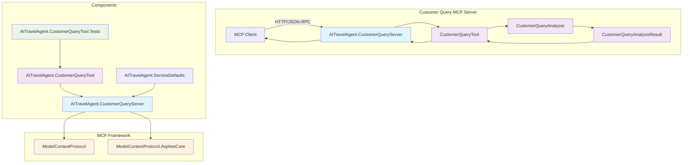

# Customer Query MCP Server (.NET)

## Overview

The Customer Query MCP Server is a .NET-based Model Context Protocol (MCP) server that provides tools for analyzing customer queries in the travel industry. This server analyzes customer messages to extract emotional context, intent, requirements, and preferences to help travel agents provide better service.

## Functionality

This MCP server provides intelligent analysis of customer queries to help travel agents understand:

- **Emotional State**: Detect customer emotions (happy, sad, angry, neutral)
- **Intent Analysis**: Identify what the customer wants to do (book_flight, cancel_flight, change_flight, inquire, complaint)
- **Requirements**: Extract service level preferences (business, economy, first_class)
- **Preferences**: Identify specific customer preferences (window, aisle, extra_legroom)

## MCP Tools Published

### `analyze_customer_query`

**Description**: Analyzes the customer query and provides a response with emotional context, intent, requirements, and preferences.

**Parameters**:
- `customerQuery` (string): The customer query text to analyze

**Returns**: `CustomerQueryAnalysisResult` object containing:
- `CustomerQuery`: The original query text
- `Emotion`: Detected emotional state (happy, sad, angry, neutral)
- `Intent`: Customer's intent (book_flight, cancel_flight, change_flight, inquire, complaint)
- `Requirements`: Service level requirements (business, economy, first_class)
- `Preferences`: Specific preferences (window, aisle, extra_legroom)

**Example Usage**:
```json
{
  "tool": "analyze_customer_query",
  "parameters": {
    "customerQuery": "I'm frustrated with my cancelled flight and need to book a new business class ticket"
  }
}
```

**Example Response**:
```json
{
  "CustomerQuery": "I'm frustrated with my cancelled flight and need to book a new business class ticket",
  "Emotion": "angry",
  "Intent": "book_flight",
  "Requirements": "business",
  "Preferences": "window"
}
```

## Architecture



## Project Structure

The solution consists of four main projects:

### 1. AITravelAgent.CustomerQueryServer
- **Purpose**: ASP.NET Core web application that hosts the MCP server
- **Key Files**:
  - `Program.cs`: Application entry point and MCP server configuration
  - `Tools/CustomerQueryTool.cs`: MCP tool implementation
  - `Tools/EchoTool.cs`: Additional utility tool
- **Dependencies**: ModelContextProtocol, ModelContextProtocol.AspNetCore

### 2. AITravelAgent.CustomerQueryTool
- **Purpose**: Core business logic for customer query analysis
- **Key Files**:
  - `CustomerQueryAnalyzer.cs`: Main analysis logic
  - `CustomerQueryAnalysisResult.cs`: Result data model
- **Dependencies**: None (standalone library)

### 3. AITravelAgent.ServiceDefaults
- **Purpose**: Shared configuration and telemetry setup
- **Dependencies**: Microsoft.Extensions.ServiceDiscovery, OpenTelemetry packages

### 4. AITravelAgent.CustomerQueryTool.Tests
- **Purpose**: Unit tests for the customer query analysis functionality
- **Framework**: MSTest
- **Coverage**: Comprehensive tests for all analysis functions and edge cases

## External Dependencies and Libraries

### Core MCP Framework
- **ModelContextProtocol**: Core MCP protocol implementation
  - Provides the foundation for creating MCP servers and tools
  - Handles JSON-RPC communication protocol
  - Documentation: [Model Context Protocol Specification](https://spec.modelcontextprotocol.io/)

- **ModelContextProtocol.AspNetCore**: ASP.NET Core integration for MCP
  - Enables hosting MCP servers in ASP.NET Core applications
  - Provides HTTP transport layer for MCP communication
  - Includes middleware for handling MCP requests

### Microsoft Frameworks
- **.NET 8.0**: Target framework providing modern C# features and performance improvements
- **ASP.NET Core**: Web framework for hosting the MCP server
- **Microsoft.Extensions.ServiceDiscovery**: Service discovery capabilities for distributed systems
- **Microsoft.Extensions.Http.Resilience**: HTTP resilience patterns and retry policies

### Telemetry and Monitoring
- **OpenTelemetry**: Observability framework for distributed tracing and metrics
  - **OpenTelemetry.Exporter.OpenTelemetryProtocol**: OTLP exporter for telemetry data
  - **OpenTelemetry.Extensions.Hosting**: Integration with .NET hosting model
  - **OpenTelemetry.Instrumentation.AspNetCore**: Automatic instrumentation for ASP.NET Core
  - **OpenTelemetry.Instrumentation.Http**: HTTP client instrumentation
  - **OpenTelemetry.Instrumentation.Runtime**: .NET runtime metrics collection

### Testing Framework
- **MSTest**: Microsoft's unit testing framework
  - Modern testing features and test discovery
  - Integration with Visual Studio and CI/CD pipelines
  - Support for async testing and parameterized tests

## Getting Started

### Prerequisites
- .NET 8.0 SDK
- Visual Studio 2022 or VS Code with C# extension

### Building the Project
```bash
cd src/tools/customer-query
dotnet build
```

### Running Tests
```bash
cd src/tools/customer-query
dotnet test
```

### Running the Server
```bash
cd src/tools/customer-query/AITravelAgent.CustomerQueryServer
dotnet run
```

The server will start and listen for MCP connections on the configured port.

## Configuration

The server can be configured through:
- `appsettings.json`: Basic application settings
- Environment variables: For deployment-specific configuration
- Service defaults: Shared configuration across multiple services

## Development Notes

### Current Implementation
The current `CustomerQueryAnalyzer` implementation uses randomized responses for demonstration purposes. This simulates the behavior of an AI-powered analysis system while providing consistent API structure.

### Future Enhancements
- Integration with actual NLP/AI services for real query analysis
- Machine learning model training on customer service data
- Support for additional languages and cultural context
- Integration with customer history and preferences database
- Real-time sentiment analysis improvements

## Testing Strategy

The test suite covers:
- **Functional Testing**: Verify all tool functions work correctly
- **Input Validation**: Test handling of various input formats and edge cases
- **Data Integrity**: Ensure returned data matches expected formats and ranges
- **Performance Testing**: Verify response times meet requirements
- **Randomization Testing**: Confirm system produces varied but valid results

## Deployment

The server can be deployed as:
- Docker container (Dockerfile included)
- Kubernetes deployment
- Azure App Service
- Self-hosted on Windows/Linux servers

## Troubleshooting

### Common Issues
1. **Build Errors**: Ensure .NET 8.0 SDK is installed
2. **Port Conflicts**: Check that the configured port is available
3. **Package Restore Issues**: Run `dotnet restore` to restore NuGet packages

### Logging
The application uses structured logging through the .NET logging framework. Check application logs for detailed error information and request traces.