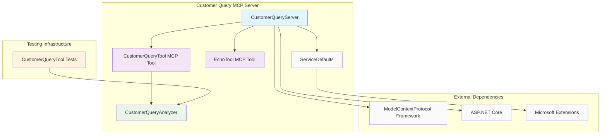

# Customer Query Analysis MCP Tools

## Overview

The Customer Query Analysis MCP Tools are a collection of .NET-based Model Context Protocol (MCP) tools designed to analyze customer queries in the travel industry. These tools provide intelligent analysis of customer requests, extracting emotional context, intent, requirements, and preferences to improve customer service and automate response workflows.

## Architecture

The solution consists of four main components organized in a clean, modular architecture:



## Components

### 1. CustomerQueryServer
- **Purpose**: Main MCP server application hosting the analysis tools
- **Technology**: ASP.NET Core Web Application
- **Framework**: .NET 8.0
- **Dependencies**: 
  - `ModelContextProtocol.AspNetCore` - MCP server framework
  - `ServiceDefaults` - Shared configuration and services

### 2. CustomerQueryTool (MCP Tool)
- **Purpose**: Exposes customer query analysis functionality via MCP protocol
- **Type**: MCP Server Tool
- **Method**: `analyze_customer_query`
- **Input**: Customer query string
- **Output**: `CustomerQueryAnalysisResult` with emotion, intent, requirements, and preferences

### 3. CustomerQueryAnalyzer (Core Logic)
- **Purpose**: Core business logic for analyzing customer queries
- **Analysis Categories**:
  - **Emotions**: happy, sad, angry, neutral
  - **Intents**: book_flight, cancel_flight, change_flight, inquire, complaint
  - **Requirements**: business, economy, first_class
  - **Preferences**: window, aisle, extra_legroom

### 4. ServiceDefaults
- **Purpose**: Shared service configuration and defaults
- **Features**: Observability, service discovery, resilience patterns
- **Dependencies**:
  - Microsoft.Extensions.Http.Resilience
  - Microsoft.Extensions.ServiceDiscovery
  - OpenTelemetry instrumentation

### 5. CustomerQueryTool.Tests
- **Purpose**: Comprehensive unit testing suite
- **Framework**: MSTest with .NET 8.0
- **Coverage**: 10 test methods covering all analyzer functionality
- **Test Categories**:
  - Input validation (valid, empty, null queries)
  - Output validation (emotions, intents, requirements, preferences)
  - Performance testing (execution time)
  - Randomness verification
  - Complex query handling

## MCP Tools Published

### analyze_customer_query
- **Name**: `analyze_customer_query`
- **Title**: "Analyze Customer Query"
- **Description**: "Analyzes the customer query and provides a response."
- **Parameters**:
  - `customerQuery` (string): The customer query to analyze
- **Returns**: `CustomerQueryAnalysisResult` object containing:
  - `CustomerQuery`: Original query text
  - `Emotion`: Detected emotional state
  - `Intent`: Identified customer intent
  - `Requirements`: Service level requirements
  - `Preferences`: Customer preferences

## External Dependencies

### Core Framework Dependencies
- **ModelContextProtocol**: Framework for building MCP servers and tools
- **ModelContextProtocol.AspNetCore**: ASP.NET Core integration for MCP
- **Microsoft.AspNetCore.App**: Core web framework

### Observability and Resilience
- **Microsoft.Extensions.Http.Resilience**: HTTP resilience patterns
- **Microsoft.Extensions.ServiceDiscovery**: Service discovery capabilities
- **OpenTelemetry**: Distributed tracing and metrics
  - `OpenTelemetry.Exporter.OpenTelemetryProtocol`
  - `OpenTelemetry.Extensions.Hosting`
  - `OpenTelemetry.Instrumentation.AspNetCore`
  - `OpenTelemetry.Instrumentation.Http`
  - `OpenTelemetry.Instrumentation.Runtime`

### Testing Framework
- **MSTest.Sdk**: Modern MSTest framework for .NET
- **Microsoft.NET.Test.Sdk**: Test platform SDK

## Configuration and Deployment

### Development Environment
- **.NET 8.0**: Target framework
- **Visual Studio 2022**: Recommended IDE
- **Docker**: Containerization support via Dockerfile

### Server Configuration
```csharp
var builder = WebApplication.CreateBuilder(args);

builder.AddServiceDefaults();
builder.Services.AddMcpServer()
                .WithHttpTransport()
                .WithToolsFromAssembly();

var app = builder.Build();
app.MapDefaultEndpoints();
app.MapMcp();
```

### MCP Tool Registration
Tools are automatically discovered and registered using the `WithToolsFromAssembly()` configuration, scanning for classes marked with `[McpServerToolType]` and methods marked with `[McpServerTool]`.

## Usage Examples

### Basic Query Analysis
```json
{
  "method": "tools/call",
  "params": {
    "name": "analyze_customer_query",
    "arguments": {
      "customerQuery": "I'm frustrated and need to cancel my business class flight to London"
    }
  }
}
```

### Expected Response
```json
{
  "result": {
    "CustomerQuery": "I'm frustrated and need to cancel my business class flight to London",
    "Emotion": "angry",
    "Intent": "cancel_flight",
    "Requirements": "business",
    "Preferences": "window"
  }
}
```

## Testing

### Running Tests
```bash
cd src/tools/customer-query
dotnet test --verbosity normal
```

### Test Coverage
- **10 test methods** covering comprehensive functionality
- **Input validation**: Valid, empty, and null queries
- **Output validation**: All analysis categories
- **Performance testing**: Execution time validation (~1 second)
- **Randomness testing**: Multiple calls with same input
- **Complex scenarios**: Real-world customer query examples

### Building the Solution
```bash
cd src/tools/customer-query
dotnet build
dotnet run --project AITravelAgent.CustomerQueryServer
```

## Security Considerations

- **Input Sanitization**: All customer queries are processed safely
- **No Data Persistence**: Analysis results are not stored permanently
- **Secure Defaults**: ServiceDefaults includes security best practices
- **Observability**: Full tracing and monitoring capabilities

## Performance Characteristics

- **Analysis Time**: Approximately 1 second per query (simulated processing)
- **Concurrency**: Supports multiple concurrent requests
- **Resource Usage**: Lightweight operation with minimal memory footprint
- **Scalability**: Horizontally scalable via containerization

## Future Enhancements

- **Machine Learning Integration**: Replace random analysis with ML models
- **Real-time Processing**: Reduce analysis latency
- **Extended Categories**: Add more emotion, intent, and preference categories
- **Multi-language Support**: Support for queries in multiple languages
- **Analytics Dashboard**: Real-time analytics and insights