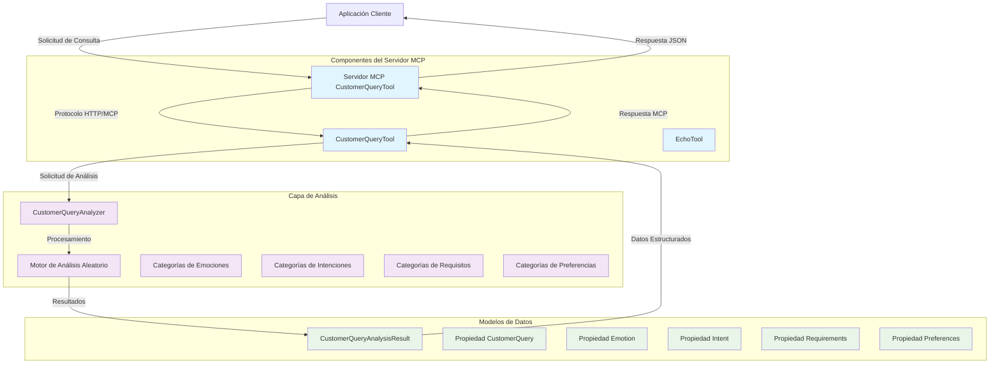

# Herramientas MCP de Consulta de Cliente - Documentación

## Resumen

Las Herramientas MCP de Consulta de Cliente proporcionan capacidades de análisis inteligente para consultas de clientes en el dominio de viajes. Esta solución basada en .NET implementa herramientas del Protocolo de Contexto de Modelo (MCP) que pueden analizar mensajes de clientes para extraer sentimientos emocionales, intenciones, requisitos y preferencias.

## Funcionalidad

### Componentes Principales

#### 1. CustomerQueryAnalyzer
El motor principal de análisis que procesa las consultas de clientes y devuelve resultados de análisis estructurados.

**Características:**
- **Detección de Emociones**: Identifica el estado emocional del cliente (feliz, triste, enojado, neutral)
- **Reconocimiento de Intención**: Determina la intención del cliente (reservar_vuelo, cancelar_vuelo, cambiar_vuelo, consultar, queja)
- **Extracción de Requisitos**: Identifica preferencias de clase de servicio (business, economy, first_class)
- **Análisis de Preferencias**: Detecta preferencias de asientos (ventana, pasillo, espacio_extra_piernas)

#### 2. CustomerQueryAnalysisResult
Estructura de datos que encapsula los resultados del análisis con las siguientes propiedades:
- `CustomerQuery`: Mensaje original del cliente
- `Emotion`: Estado emocional detectado
- `Intent`: Intención del cliente identificada
- `Requirements`: Requisitos de servicio extraídos
- `Preferences`: Preferencias del cliente identificadas

### Herramientas MCP Publicadas

#### analyze_customer_query
**Descripción**: Analiza consultas de clientes y proporciona información estructurada sobre el sentimiento, intención y preferencias del cliente.

**Parámetros:**
- `customerQuery` (string): El mensaje del cliente a analizar

**Retorna:**
- `CustomerQueryAnalysisResult`: Análisis estructurado que contiene emoción, intención, requisitos y preferencias

## Diagrama de Arquitectura



## Componentes Externos y Dependencias

### Dependencias del Framework

#### Microsoft.NET.Sdk
- **Versión**: 8.0+ (originalmente apunta a .NET 9.0)
- **Propósito**: SDK principal de .NET para construir y ejecutar la aplicación
- **Documentación**: [Documentación de Microsoft .NET](https://docs.microsoft.com/es-es/dotnet/)

#### ModelContextProtocol
- **Versión**: 0.*-* (última versión preliminar)
- **Propósito**: Implementación central del protocolo MCP
- **Funcionalidad**: Proporciona las capacidades fundamentales del servidor MCP

### Dependencias de Pruebas

#### MSTest.Sdk
- **Versión**: 3.8.3
- **Propósito**: Framework de pruebas de Microsoft para .NET
- **Características**:
  - Ejecución de pruebas unitarias
  - Descubrimiento y ejecución de pruebas
  - Métodos de aserción
  - Gestión del ciclo de vida de pruebas

## Estructura del Proyecto

```
src/tools/customer-query/
├── AITravelAgent.CustomerQueryServer/          # Aplicación del Servidor MCP
├── AITravelAgent.CustomerQueryTool/            # Biblioteca de Análisis Principal
├── AITravelAgent.CustomerQueryTool.Tests/      # Pruebas Unitarias
├── AITravelAgent.ServiceDefaults/              # Configuración de Servicios Compartidos
├── AITravelAgent.sln                           # Archivo de solución
└── Dockerfile                                  # Configuración del contenedor
```

## Configuración y Despliegue

### Requisitos del Entorno
- SDK de .NET 8.0+
- Visual Studio 2022 o IDE compatible
- Docker (opcional, para despliegue en contenedores)

### Construcción del Proyecto
```bash
# Restaurar dependencias
dotnet restore

# Construir la solución
dotnet build

# Ejecutar pruebas
dotnet test

# Ejecutar el servidor
dotnet run --project AITravelAgent.CustomerQueryServer
```

## Estrategia de Pruebas

### Cobertura de Pruebas Unitarias
- **CustomerQueryAnalyzer**: Valida la lógica de análisis, tipos de valores de retorno, restricciones de tiempo
- **CustomerQueryAnalysisResult**: Prueba las propiedades del modelo de datos y la inicialización
- **Casos Límite**: Entradas nulas, cadenas vacías, condiciones de frontera

## Patrones de Uso

### Integración con Clientes MCP
Las herramientas de consulta de cliente están diseñadas para integrarse con sistemas de IA y aplicaciones compatibles con MCP:

1. **Integración con Asistente de IA**: Proporciona contexto sobre el sentimiento e intención del cliente
2. **Automatización del Servicio al Cliente**: Enrutamiento automatizado basado en análisis de intención
3. **Análisis y Reportes**: Análisis agregado para inteligencia empresarial
4. **Procesamiento en Tiempo Real**: Análisis inmediato de comunicaciones de clientes