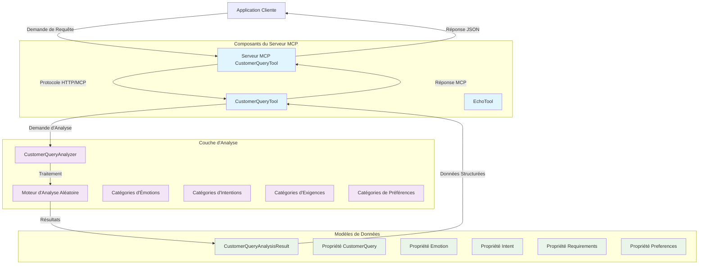

# Outils MCP de Requête Client - Documentation

## Aperçu

Les Outils MCP de Requête Client fournissent des capacités d'analyse intelligente pour les requêtes de clients dans le domaine du voyage. Cette solution basée sur .NET implémente des outils du Protocole de Contexte de Modèle (MCP) qui peuvent analyser les messages des clients pour extraire le sentiment émotionnel, l'intention, les exigences et les préférences.

## Fonctionnalité

### Composants Principaux

#### 1. CustomerQueryAnalyzer
Le moteur d'analyse principal qui traite les requêtes des clients et retourne des résultats d'analyse structurés.

**Caractéristiques :**
- **Détection d'Émotion** : Identifie l'état émotionnel du client (heureux, triste, en colère, neutre)
- **Reconnaissance d'Intention** : Détermine l'intention du client (réserver_vol, annuler_vol, changer_vol, demander, plainte)
- **Extraction d'Exigences** : Identifie les préférences de classe de service (business, economy, first_class)
- **Analyse de Préférences** : Détecte les préférences de siège (hublot, couloir, espace_jambes_supplémentaire)

#### 2. CustomerQueryAnalysisResult
Structure de données qui encapsule les résultats d'analyse avec les propriétés suivantes :
- `CustomerQuery` : Message original du client
- `Emotion` : État émotionnel détecté
- `Intent` : Intention du client identifiée
- `Requirements` : Exigences de service extraites
- `Preferences` : Préférences du client identifiées

### Outils MCP Publiés

#### analyze_customer_query
**Description** : Analyse les requêtes des clients et fournit des informations structurées sur le sentiment, l'intention et les préférences du client.

**Paramètres :**
- `customerQuery` (string) : Le message du client à analyser

**Retourne :**
- `CustomerQueryAnalysisResult` : Analyse structurée contenant émotion, intention, exigences et préférences

## Diagramme d'Architecture



## Composants Externes et Dépendances

### Dépendances du Framework

#### Microsoft.NET.Sdk
- **Version** : 8.0+ (cible originalement .NET 9.0)
- **Objectif** : SDK principal .NET pour construire et exécuter l'application
- **Documentation** : [Documentation Microsoft .NET](https://docs.microsoft.com/fr-fr/dotnet/)

#### ModelContextProtocol
- **Version** : 0.*-* (dernière version préliminaire)
- **Objectif** : Implémentation centrale du protocole MCP
- **Fonctionnalité** : Fournit les capacités fondamentales du serveur MCP

### Dépendances de Test

#### MSTest.Sdk
- **Version** : 3.8.3
- **Objectif** : Framework de test Microsoft pour .NET
- **Caractéristiques** :
  - Exécution de tests unitaires
  - Découverte et exécution de tests
  - Méthodes d'assertion
  - Gestion du cycle de vie des tests

## Structure du Projet

```
src/tools/customer-query/
├── AITravelAgent.CustomerQueryServer/          # Application Serveur MCP
├── AITravelAgent.CustomerQueryTool/            # Bibliothèque d'Analyse Principale
├── AITravelAgent.CustomerQueryTool.Tests/      # Tests Unitaires
├── AITravelAgent.ServiceDefaults/              # Configuration de Services Partagés
├── AITravelAgent.sln                           # Fichier de solution
└── Dockerfile                                  # Configuration du conteneur
```

## Configuration et Déploiement

### Exigences d'Environnement
- SDK .NET 8.0+
- Visual Studio 2022 ou IDE compatible
- Docker (optionnel, pour déploiement en conteneurs)

### Construction du Projet
```bash
# Restaurer les dépendances
dotnet restore

# Construire la solution
dotnet build

# Exécuter les tests
dotnet test

# Exécuter le serveur
dotnet run --project AITravelAgent.CustomerQueryServer
```

## Stratégie de Test

### Couverture des Tests Unitaires
- **CustomerQueryAnalyzer** : Valide la logique d'analyse, les types de valeurs de retour, les contraintes de temps
- **CustomerQueryAnalysisResult** : Teste les propriétés du modèle de données et l'initialisation
- **Cas Limites** : Entrées nulles, chaînes vides, conditions aux limites

## Modèles d'Utilisation

### Intégration avec les Clients MCP
Les outils de requête client sont conçus pour s'intégrer avec les systèmes d'IA et applications compatibles MCP :

1. **Intégration Assistant IA** : Fournit du contexte sur le sentiment et l'intention du client
2. **Automatisation du Service Client** : Routage automatisé basé sur l'analyse d'intention
3. **Analyses et Rapports** : Analyse agrégée pour l'intelligence d'affaires
4. **Traitement en Temps Réel** : Analyse immédiate des communications clients

### Meilleures Pratiques
- Toujours valider les requêtes d'entrée avant l'analyse
- Gérer gracieusement les entrées nulles et vides
- Considérer l'implémentation de mise en cache pour les requêtes fréquentes
- Surveiller les métriques de performance pour les opérations d'analyse
- Implémenter une journalisation appropriée pour le débogage et la surveillance