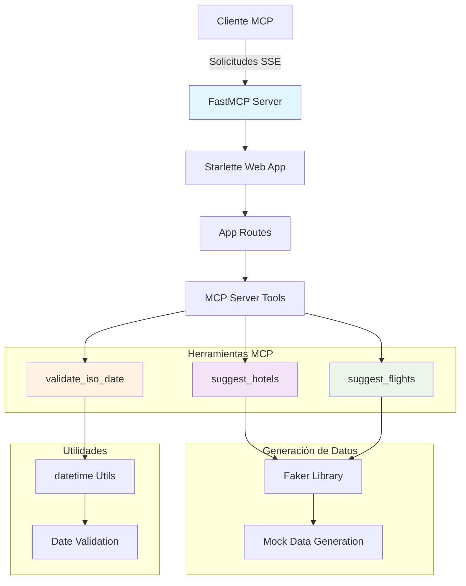
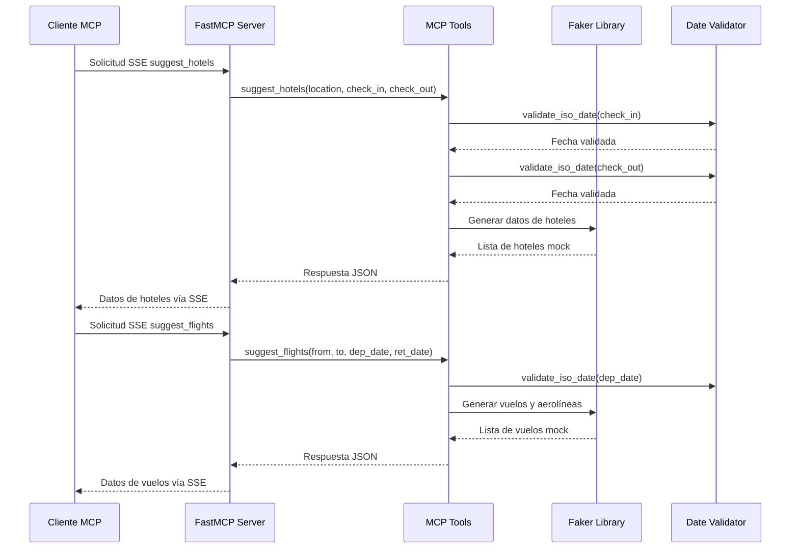

# Documentación del Escenario Python - Herramientas MCP para Planificación de Itinerarios

## Descripción General

Este escenario implementa un conjunto de herramientas MCP (Model Context Protocol) en Python para la planificación de itinerarios de viaje. El sistema proporciona sugerencias inteligentes de vuelos y hoteles a través de un servidor MCP que simula datos realistas de servicios de viaje.

## Funcionalidad Principal

El sistema permite a los agentes de viaje y clientes obtener recomendaciones personalizadas para:

- **Búsqueda de Hoteles**: Sugerencias de alojamiento basadas en ubicación, fechas y preferencias
- **Búsqueda de Vuelos**: Opciones de vuelos tanto de ida como de ida y vuelta
- **Validación de Fechas**: Verificación automática de formatos y coherencia de fechas
- **Generación de Datos Realistas**: Simulación de precios, horarios y disponibilidad

## Arquitectura del Sistema



## Diagrama de Flujo de Interacción



## Herramientas MCP Publicadas

### 1. suggest_hotels

**Descripción**: Sugiere hoteles basados en ubicación y fechas de estadía.

**Parámetros de Entrada**:
- `location` (string): Ubicación (ciudad o área) para buscar hoteles
- `check_in` (string): Fecha de entrada en formato ISO (YYYY-MM-DD)
- `check_out` (string): Fecha de salida en formato ISO (YYYY-MM-DD)

**Respuesta**:
```json
[
  {
    "name": "string - Nombre del hotel",
    "address": "string - Dirección física",
    "location": "string - Ubicación con barrio y ciudad",
    "rating": "float - Calificación (3.0-5.0)",
    "price_per_night": "int - Precio por noche en USD",
    "hotel_type": "string - Tipo (Luxury|Boutique|Budget|Business)",
    "amenities": ["array - Lista de servicios"],
    "available_rooms": "int - Habitaciones disponibles (1-15)"
  }
]
```

**Validaciones**:
- Fechas en formato ISO (YYYY-MM-DD)
- Fecha de salida posterior a fecha de entrada
- Ubicación no vacía

**Ejemplo de Uso**:
```python
result = await suggest_hotels(
    location="Barcelona",
    check_in="2024-12-20",
    check_out="2024-12-25"
)
```

### 2. suggest_flights

**Descripción**: Sugiere vuelos basados en origen, destino y fechas de viaje.

**Parámetros de Entrada**:
- `from_location` (string): Ubicación de salida (ciudad o aeropuerto)
- `to_location` (string): Ubicación de destino (ciudad o aeropuerto)
- `departure_date` (string): Fecha de salida en formato ISO (YYYY-MM-DD)
- `return_date` (string, opcional): Fecha de regreso en formato ISO (YYYY-MM-DD)

**Respuesta**:
```json
{
  "departure_flights": [
    {
      "flight_id": "string - ID único del vuelo",
      "airline": "string - Aerolínea",
      "flight_number": "string - Número de vuelo",
      "aircraft": "string - Tipo de aeronave",
      "from_airport": {
        "code": "string - Código del aeropuerto",
        "name": "string - Nombre del aeropuerto",
        "city": "string - Ciudad"
      },
      "to_airport": { /* mismo formato que from_airport */ },
      "departure": "string - Hora de salida ISO",
      "arrival": "string - Hora de llegada ISO",
      "duration_minutes": "int - Duración en minutos",
      "is_direct": "boolean - Si es vuelo directo",
      "price": "float - Precio en USD",
      "currency": "string - Moneda (USD)",
      "available_seats": "int - Asientos disponibles",
      "cabin_class": "string - Clase de cabina",
      "segments": [ /* Solo para vuelos con conexión */ ]
    }
  ],
  "return_flights": [ /* Mismo formato, solo si return_date está presente */ ]
}
```

**Validaciones**:
- Fechas en formato ISO válido
- Fecha de regreso posterior a fecha de salida (si se proporciona)
- Ubicaciones de origen y destino no vacías

**Características de Vuelos Generados**:
- **Horarios**: Entre 6:00 AM y 10:00 PM
- **Duración**: 1-8 horas (60-480 minutos)
- **Precios**: $99-$999 USD
- **Clases**: Economy, Premium Economy, Business, First
- **Conexiones**: 60% vuelos directos, 40% con conexión

### 3. validate_iso_date

**Descripción**: Función utilitaria para validar fechas en formato ISO.

**Parámetros**:
- `date_str` (string): Cadena de fecha a validar
- `param_name` (string): Nombre del parámetro para mensajes de error

**Retorna**: 
- `datetime.date`: Objeto fecha validado

**Excepciones**:
- `ValueError`: Si el formato no es ISO o la fecha es inválida

## Estructura del Proyecto

```
src/tools/itinerary-planning/
│
├── src/                                         # Código fuente
│   ├── mcp_server.py                           # Servidor MCP con herramientas
│   ├── app.py                                  # Aplicación Starlette principal
│   └── app_routes.py                           # Rutas web y manejo SSE
│
├── tests/                                      # Pruebas unitarias
│   ├── __init__.py                            # Inicialización del módulo
│   └── test_mcp_server.py                     # Pruebas de herramientas MCP
│
├── pyproject.toml                             # Configuración del proyecto
├── uv.lock                                    # Lock file de dependencias
├── Dockerfile                                 # Configuración de contenedor
└── README.md                                  # Documentación básica
```

## Dependencias y Referencias Externas

### Dependencias Principales

#### mcp[cli] (Versión >=1.3.0)
- **Propósito**: Implementación del protocolo MCP para Python
- **Funcionalidad**: Servidor MCP, transporte SSE, decoradores de herramientas
- **Documentación**: [MCP Protocol Documentation](https://modelcontextprotocol.io/)
- **Componentes Utilizados**:
  - `FastMCP`: Servidor MCP simplificado
  - `SseServerTransport`: Transporte Server-Sent Events
  - Decoradores para definición de herramientas

#### Starlette (Versión >=0.46.1)
- **Propósito**: Framework web ASGI ligero
- **Funcionalidad**: Servidor web, routing, middleware
- **Documentación**: [Starlette Documentation](https://www.starlette.io/)
- **Uso**: Base para servir el servidor MCP vía HTTP/SSE

#### Uvicorn (Versión >=0.34.0)
- **Propósito**: Servidor ASGI de alto rendimiento
- **Funcionalidad**: Servidor web production-ready
- **Documentación**: [Uvicorn Documentation](https://www.uvicorn.org/)
- **Uso**: Servidor de aplicación para despliegue

#### Faker (Versión >=37.1.0)
- **Propósito**: Generación de datos sintéticos realistas
- **Funcionalidad**: Creación de direcciones, nombres, datos de contacto
- **Documentación**: [Faker Documentation](https://faker.readthedocs.io/)
- **Uso**: Generar datos mock para hoteles y vuelos

#### httpx (Versión >=0.28.1)
- **Propósito**: Cliente HTTP moderno y asíncrono
- **Funcionalidad**: Peticiones HTTP con soporte async/await
- **Documentación**: [HTTPX Documentation](https://www.python-httpx.org/)
- **Uso**: Comunicación con APIs externas (futuras integraciones)

### Dependencias de Desarrollo y Testing

#### pytest (Versión >=8.0.0)
- **Propósito**: Framework de pruebas moderno para Python
- **Funcionalidad**: Descubrimiento automático, fixtures, parametrización
- **Documentación**: [Pytest Documentation](https://docs.pytest.org/)

#### pytest-asyncio (Versión >=0.23.0)
- **Propósito**: Soporte para pruebas asíncronas
- **Funcionalidad**: Decoradores y fixtures para async/await
- **Documentación**: [pytest-asyncio Documentation](https://pytest-asyncio.readthedocs.io/)

### Dependencias Transitivas Importantes

#### Pydantic (Versión 2.x)
- **Propósito**: Validación de datos y serialización
- **Funcionalidad**: Esquemas de datos tipados, validación automática
- **Uso**: Validación de parámetros de herramientas MCP

#### typing-extensions
- **Propósito**: Extensiones de tipado para Python
- **Funcionalidad**: Anotaciones de tipo avanzadas
- **Uso**: Anotaciones para `Annotated` y `Field`

## Configuración y Despliegue

### Requisitos del Sistema
- Python 3.12 o superior
- pip o uv para gestión de dependencias
- Puerto 8000 disponible para el servidor web

### Instalación de Dependencias
```bash
cd src/tools/itinerary-planning
pip install -e .
```

### Instalación con Dependencias de Testing
```bash
pip install -e ".[test]"
```

### Ejecución del Servidor
```bash
cd src/tools/itinerary-planning
python src/app.py
```

### Ejecución de Pruebas
```bash
cd src/tools/itinerary-planning
pytest tests/ -v
```

### Usando Docker
```bash
cd src/tools/itinerary-planning
docker build -t itinerary-planning-mcp .
docker run -p 8000:8000 itinerary-planning-mcp
```

## Características Técnicas

### Generación de Datos Mock

#### Algoritmos de Hoteles
- **Tipos**: Luxury, Boutique, Budget, Business
- **Ratings**: 3.0-5.0 con distribución realista
- **Precios**: Basados en tipo de hotel
  - Luxury: $250-600/noche
  - Boutique: $180-350/noche
  - Budget: $80-150/noche
  - Business: $150-300/noche
- **Amenidades**: Selección aleatoria de 3-6 servicios
- **Ubicaciones**: Barrios realistas por ciudad

#### Algoritmos de Vuelos
- **Aerolíneas**: 8 aerolíneas ficticias con nombres realistas
- **Aeronaves**: Modelos reales (Boeing 737, Airbus A320, etc.)
- **Códigos de Aeropuerto**: Generación basada en ciudad
- **Horarios**: Distribución realista 6 AM - 10 PM
- **Conexiones**: 40% de vuelos con escala
- **Tiempos de Conexión**: 45 minutos - 3 horas

### Validación y Manejo de Errores

#### Validación de Fechas
- Formato ISO estricto (YYYY-MM-DD)
- Verificación de fechas válidas
- Validación de secuencia lógica (salida < regreso)

#### Manejo de Errores
- Mensajes descriptivos en español e inglés
- Códigos de error específicos por tipo de validación
- Logging detallado para debugging

### Rendimiento y Escalabilidad

#### Características de Rendimiento
- **Asíncrono**: Soporte completo para async/await
- **Generación Rápida**: Datos mock generados en memoria
- **Sin Estado**: Diseño stateless para escalabilidad horizontal
- **Caching**: Oportunidad para implementar caching de resultados

#### Métricas de Rendimiento Típicas
- Generación de hoteles: ~10ms
- Generación de vuelos: ~15-25ms
- Validación de fechas: <1ms

## Integración con MCP

### Transporte SSE (Server-Sent Events)
- **Endpoint**: `/sse` para conexiones MCP
- **Protocol**: JSON-RPC sobre SSE
- **Ventajas**: Conexión persistente, push en tiempo real

### Formato de Mensajes MCP
```json
{
  "jsonrpc": "2.0",
  "method": "tools/call",
  "params": {
    "name": "suggest_hotels",
    "arguments": {
      "location": "Madrid",
      "check_in": "2024-12-20",
      "check_out": "2024-12-25"
    }
  },
  "id": "unique-request-id"
}
```

## Casos de Uso Típicos

### Búsqueda de Hoteles para Viaje de Negocios
```python
hotels = await suggest_hotels(
    location="Barcelona",
    check_in="2024-01-15",
    check_out="2024-01-18"
)
# Retorna hoteles business con servicios apropiados
```

### Planificación de Viaje de Ida y Vuelta
```python
flights = await suggest_flights(
    from_location="Madrid",
    to_location="Paris",
    departure_date="2024-02-10",
    return_date="2024-02-17"
)
# Retorna vuelos de ida y vuelta coordinados
```

### Búsqueda de Vuelo Solo Ida
```python
flights = await suggest_flights(
    from_location="London",
    to_location="New York",
    departure_date="2024-03-01"
    # return_date omitido
)
# Retorna solo vuelos de ida
```

## Monitoreo y Observabilidad

### Logging
- Requests/responses loggeados
- Errores de validación registrados
- Métricas de tiempo de generación

### Métricas Sugeridas
- Número de búsquedas por herramienta
- Tiempo promedio de respuesta
- Distribución de destinos más buscados
- Patrones de fechas de viaje

## Extensiones Futuras

### Integraciones Reales
- APIs de aerolíneas reales (Amadeus, Sabre)
- Sistemas de reserva de hoteles (Booking.com API)
- Proveedores de precios en tiempo real

### Funcionalidades Adicionales
- Filtros avanzados (precio, rating, amenidades)
- Recomendaciones basadas en historial
- Integración con calendarios
- Notificaciones de cambios de precio
- Soporte multi-idioma

### Mejoras Técnicas
- Cache distribuido con Redis
- Base de datos para persistencia
- Métricas avanzadas con Prometheus
- Trazabilidad distribuida
- Rate limiting por cliente

## Seguridad

### Consideraciones Actuales
- Validación estricta de entrada
- Sanitización de parámetros
- Manejo seguro de excepciones

### Recomendaciones para Producción
- Autenticación de clientes MCP
- Rate limiting por IP/cliente
- Validación de CORS apropiada
- Logging de auditoría
- Encriptación en tránsito (HTTPS)
- Filtrado de contenido malicioso