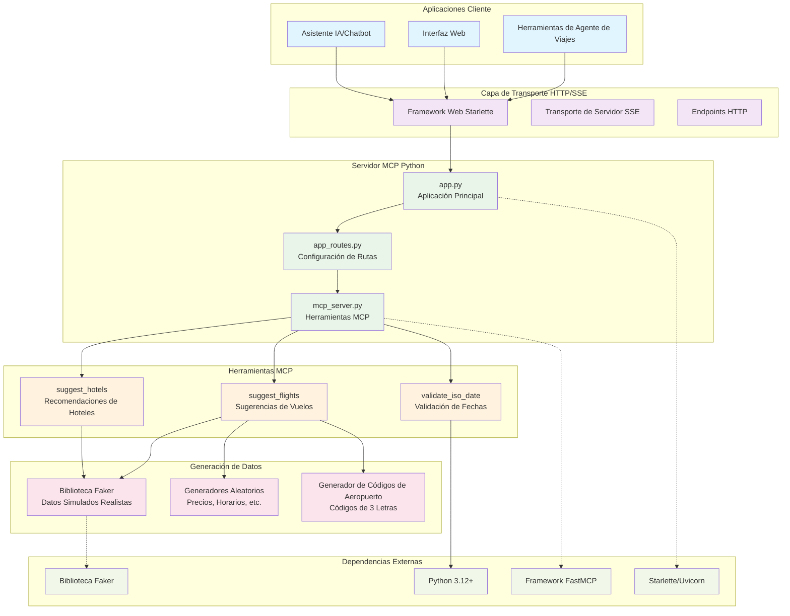

# Planificación de Itinerarios - Herramientas MCP Python

## Resumen

Este documento describe la implementación de las Herramientas MCP (Protocolo de Contexto de Modelo) para la Planificación de Itinerarios del sistema Contoso Travel Agents. Esta solución basada en Python proporciona capacidades integrales de planificación de viajes incluyendo recomendaciones de hoteles y sugerencias de vuelos con generación realista de datos simulados.

## Funcionalidad

La herramienta de Planificación de Itinerarios sirve como un servicio integral de planificación de viajes que genera opciones de viaje realistas para los clientes. Proporciona sugerencias detalladas de hoteles y vuelos basadas en las preferencias, fechas y destinos de los clientes.

### Características Principales

- **Sugerencias de Hoteles**: Genera recomendaciones realistas de hoteles con calificaciones, precios y amenidades
- **Sugerencias de Vuelos**: Proporciona opciones de vuelos tanto de ida como de ida y vuelta con manejo de conexiones
- **Generación de Datos Realistas**: Crea datos de viaje creíbles usando la biblioteca Faker
- **Validación de Fechas**: Asegura formato ISO apropiado de fechas y orden lógico de fechas
- **Múltiples Opciones de Transporte**: Soporta vuelos tanto directos como con conexiones
- **Detalles Completos**: Incluye información de precios, disponibilidad y clase de servicio

## Herramientas MCP Publicadas

### 1. suggest_hotels

**Nombre**: `suggest_hotels`  
**Descripción**: Sugerir hoteles basado en ubicación y fechas.

**Parámetros**:
- `location` (string): Ubicación (ciudad o área) para buscar hoteles
- `check_in` (string): Fecha de check-in en formato ISO (YYYY-MM-DD)
- `check_out` (string): Fecha de check-out en formato ISO (YYYY-MM-DD)

**Retorna**: Lista de objetos de hotel que contienen:
- `name`: Nombre del hotel
- `address`: Dirección de la calle
- `location`: Vecindario y ciudad
- `rating`: Calificación de 3.0 a 5.0
- `price_per_night`: Precio en USD
- `hotel_type`: Tipo (Lujo, Boutique, Económico, Negocios)
- `amenities`: Lista de amenidades disponibles
- `available_rooms`: Número de habitaciones disponibles

### 2. suggest_flights

**Nombre**: `suggest_flights`  
**Descripción**: Sugerir vuelos basado en ubicaciones y fechas.

**Parámetros**:
- `from_location` (string): Ubicación de salida (ciudad o aeropuerto)
- `to_location` (string): Ubicación de destino (ciudad o aeropuerto)
- `departure_date` (string): Fecha de salida en formato ISO (YYYY-MM-DD)
- `return_date` (string, opcional): Fecha de regreso en formato ISO (YYYY-MM-DD)

**Retorna**: Diccionario que contiene:
- `departure_flights`: Lista de opciones de vuelos de salida
- `return_flights`: Lista de opciones de vuelos de regreso (vacía para ida)

Cada objeto de vuelo incluye:
- `flight_id`: Identificador único del vuelo
- `airline`: Nombre de la aerolínea
- `flight_number`: Número de vuelo
- `aircraft`: Tipo de aeronave
- `from_airport`/`to_airport`: Información del aeropuerto con código, nombre y ciudad
- `departure`/`arrival`: Strings de datetime ISO
- `duration_minutes`: Duración del vuelo
- `is_direct`: Booleano indicando vuelo directo vs. con conexión
- `price`: Precio del vuelo en USD
- `available_seats`: Número de asientos disponibles
- `cabin_class`: Clase de servicio (Económica, Económica Premium, Business, Primera)
- `segments`: Detalles de conexión para vuelos no directos (si aplica)

## Diagrama de Arquitectura



## Estructura del Proyecto

```
src/tools/itinerary-planning/
├── pyproject.toml                    # Configuración del proyecto Python
├── uv.lock                          # Archivo de bloqueo de dependencias
├── Dockerfile                       # Configuración del contenedor
├── README.md                        # Documentación en inglés
├── README.es.md                     # Esta documentación en español
├── src/
│   ├── app.py                       # Punto de entrada principal de la aplicación
│   ├── app_routes.py                # Configuración de rutas HTTP
│   └── mcp_server.py                # Implementación de herramientas MCP
└── tests/
    ├── __init__.py                  # Inicialización del paquete de pruebas
    └── test_mcp_server.py           # Suite completa de pruebas
```

## Documentación de Componentes Externos

### Python 3.12+
- **Propósito**: Entorno de ejecución base para la aplicación
- **Documentación**: [Documentación Oficial de Python](https://docs.python.org/es/3/)
- **Características Principales**: 
  - Soporte async/await para operaciones concurrentes
  - Type hints para mejor calidad de código
  - Soporte integrado para datetime y expresiones regulares

### Framework FastMCP
- **Propósito**: Creación simplificada de servidores MCP y registro de herramientas
- **Paquete**: `mcp[cli]>=1.3.0`
- **Documentación**: [SDK Python MCP](https://modelcontextprotocol.io/)
- **Características Principales**:
  - Definición de herramientas basada en decoradores
  - Validación automática de tipos
  - Manejo de transporte integrado

### Framework Web Starlette
- **Propósito**: Framework web ASGI para manejo HTTP
- **Paquete**: `starlette>=0.46.1`
- **Documentación**: [Documentación de Starlette](https://www.starlette.io/)
- **Características Principales**:
  - Ligero y rápido
  - Manejo de solicitudes async
  - Sistema de enrutamiento flexible

### Servidor ASGI Uvicorn
- **Propósito**: Servidor ASGI de alto rendimiento para ejecutar la aplicación
- **Paquete**: `uvicorn>=0.34.0`
- **Documentación**: [Documentación de Uvicorn](https://www.uvicorn.org/)
- **Características Principales**:
  - Implementación de servidor async rápida
  - Recarga en caliente para desarrollo
  - Rendimiento listo para producción

### Biblioteca Faker
- **Propósito**: Generar datos falsos realistas para pruebas y demostraciones
- **Paquete**: `faker>=37.1.0`
- **Documentación**: [Documentación de Faker](https://faker.readthedocs.io/)
- **Características Principales**:
  - Generación realista de direcciones y nombres
  - Soporte de datos localizados
  - Sistema de proveedores extensible

### Cliente HTTP HTTPX
- **Propósito**: Cliente HTTP async moderno para llamadas a APIs externas
- **Paquete**: `httpx>=0.28.1`
- **Documentación**: [Documentación de HTTPX](https://www.python-httpx.org/)
- **Características Principales**:
  - Soporte de API async y sync
  - Soporte HTTP/2
  - Middleware de request/response

## Configuración y Despliegue

### Requisitos del Entorno
- Python 3.12 o superior
- Entorno virtual (recomendado)
- Acceso de red para comunicación HTTP/SSE
- Mínimo 256MB de RAM

### Configuración de Desarrollo Local

1. **Crear entorno virtual**:
   ```bash
   python -m venv venv
   source venv/bin/activate  # En Windows: venv\\Scripts\\activate
   ```

2. **Instalar dependencias**:
   ```bash
   pip install -e .
   ```

3. **Ejecutar el servidor**:
   ```bash
   python src/app.py
   ```

### Usando el Gestor de Paquetes UV

1. **Instalar con UV**:
   ```bash
   uv venv
   uv pip install -e .
   ```

2. **Ejecutar con UV**:
   ```bash
   uv run src/app.py
   ```

### Pruebas y Desarrollo

1. **Ejecutar pruebas**:
   ```bash
   python -m unittest tests.test_mcp_server -v
   ```

2. **Depurar con Inspector MCP**:
   ```bash
   uv run mcp dev src/mcp_server.py
   ```

## Ejemplos de Uso

### Sugerencias de Hoteles
```json
{
  "tool": "suggest_hotels",
  "parameters": {
    "location": "Nueva York",
    "check_in": "2024-03-15",
    "check_out": "2024-03-17"
  }
}
```

**Respuesta Esperada**:
```json
[
  {
    "name": "Hotel de Lujo",
    "address": "123 Broadway",
    "location": "Centro, Nueva York",
    "rating": 4.5,
    "price_per_night": 350,
    "hotel_type": "Lujo",
    "amenities": ["WiFi Gratis", "Piscina", "Spa", "Gimnasio"],
    "available_rooms": 8
  }
]
```

### Sugerencias de Vuelos (Solo ida)
```json
{
  "tool": "suggest_flights",
  "parameters": {
    "from_location": "Nueva York",
    "to_location": "París",
    "departure_date": "2024-03-15"
  }
}
```

### Sugerencias de Vuelos (Ida y vuelta)
```json
{
  "tool": "suggest_flights",
  "parameters": {
    "from_location": "Nueva York",
    "to_location": "París",
    "departure_date": "2024-03-15",
    "return_date": "2024-03-22"
  }
}
```

## Lógica de Generación de Datos

### Datos de Hoteles
- **Tipos**: Lujo (250-600 USD), Boutique (180-350 USD), Económico (80-150 USD), Negocios (150-300 USD)
- **Calificaciones**: 3.0 a 5.0 estrellas
- **Amenidades**: Seleccionadas aleatoriamente de un conjunto de opciones realistas
- **Disponibilidad**: 1-15 habitaciones disponibles
- **Ordenamiento**: Resultados ordenados por calificación (mayor primero)

### Datos de Vuelos
- **Aerolíneas**: 8 aerolíneas simuladas con nombres realistas
- **Aeronaves**: Tipos de aeronaves comunes (Boeing 737, Airbus A320, etc.)
- **Horarios**: Salidas entre 6 AM y 10 PM
- **Duración**: 1-8 horas para vuelos
- **Directo vs Conexión**: 60% directo, 40% con conexiones
- **Precios**: $99-$999 USD basado en ruta y clase
- **Clases**: Económica, Económica Premium, Business, Primera

### Códigos de Aeropuerto
- **Formato**: Códigos de 3 letras siguiendo la convención IATA
- **Generación**: Usa pistas del nombre de la ciudad con patrones de letras realistas
- **Hubs Comunes**: Usa códigos de hubs reales para conexiones (ATL, ORD, DFW, etc.)

## Características de Rendimiento

- **Tiempo de Respuesta**: Casi instantáneo para generación de datos
- **Throughput**: Alto manejo de solicitudes concurrentes vía operaciones async
- **Uso de Memoria**: Huella de memoria baja con estructuras de datos eficientes
- **Escalabilidad**: Escalado horizontal soportado vía containerización

## Manejo de Errores

- **Validación de Fechas**: Verificación completa del formato de fecha ISO
- **Validación Lógica**: Asegura checkout después de checkin, regreso después de salida
- **Sanitización de Entrada**: Valida todas las entradas del usuario
- **Degradación Elegante**: Maneja casos extremos sin crashes

## Consideraciones de Seguridad

- Validación de entrada para todos los parámetros
- Aplicación del formato de fecha ISO
- Sin almacenamiento persistente de datos
- Operación sin estado para seguridad
- Sin dependencias de APIs externas (reduce superficie de ataque)

## Mejoras Futuras

- Integración con APIs reales de viajes (Amadeus, Sabre)
- Sistema persistente de reservas y reservaciones
- Aprendizaje de preferencias del usuario y personalización
- Precios y disponibilidad en tiempo real
- Soporte multi-moneda
- Filtros de búsqueda avanzados y opciones de ordenamiento
- Integración con programas de lealtad
- Integración de clima y eventos locales