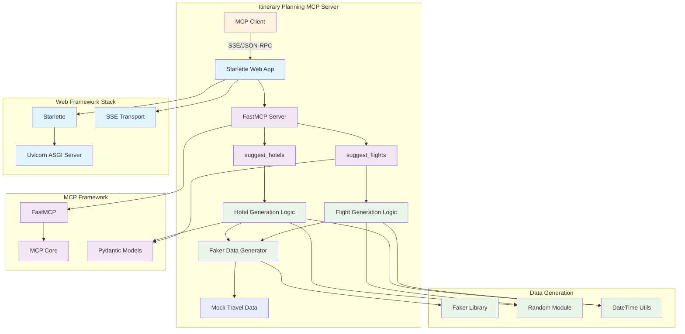

# Itinerary Planning MCP Server (Python)

## Overview

The Itinerary Planning MCP Server is a Python-based Model Context Protocol (MCP) server that provides comprehensive travel planning tools. This server generates realistic hotel and flight suggestions based on user requirements, helping travel agents and customers plan their trips effectively.

## Functionality

This MCP server provides two main planning services:

- **Hotel Suggestions**: Generate realistic hotel recommendations based on location, check-in/out dates, with detailed amenities and pricing
- **Flight Suggestions**: Provide comprehensive flight options including both direct and connecting flights with realistic pricing and schedules

## MCP Tools Published

### `suggest_hotels`

**Description**: Suggest hotels based on location and dates.

**Parameters**:
- `location` (string): Location (city or area) to search for hotels
- `check_in` (string): Check-in date in ISO format (YYYY-MM-DD)
- `check_out` (string): Check-out date in ISO format (YYYY-MM-DD)

**Returns**: List of hotel objects, each containing:
- `name`: Hotel name
- `address`: Street address
- `location`: Full location including neighborhood
- `rating`: Hotel rating (3.0-5.0)
- `price_per_night`: Price per night in USD
- `hotel_type`: Type (Luxury, Boutique, Budget, Business)
- `amenities`: List of available amenities
- `available_rooms`: Number of available rooms

**Example Usage**:
```json
{
  "tool": "suggest_hotels",
  "parameters": {
    "location": "Paris",
    "check_in": "2024-12-01",
    "check_out": "2024-12-05"
  }
}
```

### `suggest_flights`

**Description**: Suggest flights based on locations and dates.

**Parameters**:
- `from_location` (string): Departure location (city or airport)
- `to_location` (string): Destination location (city or airport)
- `departure_date` (string): Departure date in ISO format (YYYY-MM-DD)
- `return_date` (string, optional): Return date in ISO format (YYYY-MM-DD)

**Returns**: Dictionary containing:
- `departure_flights`: List of outbound flight options
- `return_flights`: List of return flight options (empty for one-way)

Each flight object contains:
- `flight_id`: Unique flight identifier
- `airline`: Airline name
- `flight_number`: Flight number
- `aircraft`: Aircraft type
- `from_airport`/`to_airport`: Airport information with code, name, and city
- `departure`/`arrival`: ISO timestamp
- `duration_minutes`: Flight duration
- `is_direct`: Boolean indicating direct flight
- `price`: Price in USD
- `available_seats`: Number of available seats
- `cabin_class`: Class of service
- `segments`: Connection details (for non-direct flights)

**Example Usage**:
```json
{
  "tool": "suggest_flights",
  "parameters": {
    "from_location": "New York",
    "to_location": "London",
    "departure_date": "2024-12-01",
    "return_date": "2024-12-15"
  }
}
```

## Architecture



## Project Structure

### Core Files

#### `src/mcp_server.py`
- **Purpose**: Main MCP server implementation with tools
- **Key Functions**:
  - `validate_iso_date()`: Date validation utility
  - `suggest_hotels()`: Hotel recommendation tool
  - `suggest_flights()`: Flight suggestion tool
- **Framework**: FastMCP for rapid MCP tool development

#### `src/app.py`
- **Purpose**: Starlette web application entry point
- **Functionality**: HTTP server for MCP communication

#### `src/app_routes.py`
- **Purpose**: Route definitions and SSE transport setup
- **Features**: Server-Sent Events (SSE) endpoint for MCP communication

### Configuration Files

#### `pyproject.toml`
- **Purpose**: Project configuration and dependencies
- **Build System**: setuptools
- **Linting**: Ruff configuration for code quality

### Testing

#### `tests/test_mcp_server.py`
- **Purpose**: Comprehensive test suite for MCP tools
- **Framework**: pytest with asyncio support
- **Coverage**: All tool functions, edge cases, and data validation

## External Dependencies and Libraries

### MCP Framework
- **mcp[cli]**: Model Context Protocol implementation for Python
  - Provides core MCP server functionality
  - Handles JSON-RPC communication
  - Includes CLI tools for development
  - Documentation: [MCP Python SDK](https://github.com/modelcontextprotocol/python-sdk)

### Web Framework
- **Starlette**: Lightweight ASGI framework
  - High-performance async web framework
  - SSE (Server-Sent Events) support for real-time communication
  - Documentation: [Starlette](https://www.starlette.io/)

- **Uvicorn**: ASGI server implementation
  - High-performance server for Python web applications
  - Supports async/await patterns
  - Production-ready with multiple worker processes

### HTTP Client
- **httpx**: Modern HTTP client for Python
  - Async/await support
  - HTTP/2 support
  - Used for external API integrations

### Data Generation
- **Faker**: Python library for generating fake data
  - Realistic mock data generation
  - Supports multiple locales and data types
  - Used for creating realistic hotel and flight data
  - Documentation: [Faker](https://faker.readthedocs.io/)

### Validation and Modeling
- **Pydantic**: Data validation using Python type annotations
  - Runtime type checking
  - JSON schema generation
  - Integration with FastMCP for parameter validation

### Testing Framework
- **pytest**: Modern Python testing framework
  - Simple and scalable test writing
  - Powerful fixtures and parametrization
  - **pytest-asyncio**: Support for testing async functions
  - **pytest-mock**: Enhanced mocking capabilities

### Development Tools
- **Ruff**: Fast Python linter and formatter
  - Replaces multiple tools (flake8, black, isort, etc.)
  - Configured for Python 3.13 compatibility
  - Enforces code quality standards

## Local Environment Setup

### Prerequisites
- Python 3.12 or higher
- uv package manager (recommended) or pip

### Installation

1. Create a Python virtual environment:
   ```bash
   uv venv
   source .venv/bin/activate  # On Windows: .venv\Scripts\activate
   ```

2. Install dependencies:
   ```bash
   uv sync
   ```

3. Install with test dependencies:
   ```bash
   uv sync --extra test
   ```

### Running the Server

#### Development Server
```bash
uv run src/app.py
```

#### MCP Server (SSE Transport)
```bash
uv run src/mcp_server.py
```

The server will start on `http://localhost:8000` with the following endpoints:
- `/`: Homepage
- `/sse`: MCP SSE endpoint
- `/messages/`: Message handling

### Running Tests

```bash
# Run all tests
uv run python -m pytest tests/ -v

# Run with coverage
uv run python -m pytest tests/ --cov=src --cov-report=html

# Run specific test class
uv run python -m pytest tests/test_mcp_server.py::TestSuggestHotels -v
```

## Debug with MCP Inspector

For testing and debugging MCP functionality, use the MCP Inspector:

```bash
uv run mcp dev src/mcp_server.py
```

This opens an interactive debugging interface for testing MCP tools.

## Development Notes

### Data Generation Strategy
The server generates realistic mock data using:
- **Hotels**: Varied types (Luxury, Boutique, Budget, Business) with appropriate pricing ranges
- **Flights**: Realistic flight times, airlines, aircraft types, and routing
- **Airports**: Simulated airport codes based on city names
- **Pricing**: Market-realistic price ranges for different service levels

### Error Handling
- Comprehensive input validation using ISO date formats
- Graceful handling of edge cases (same-day bookings, invalid dates)
- Clear error messages for debugging

### Future Enhancements
- Integration with real travel APIs (Amadeus, Sabre, etc.)
- Machine learning for personalized recommendations
- Real-time pricing and availability
- Support for additional travel services (car rentals, activities)
- Multi-language support for international travelers

## Deployment Options

### Docker Deployment
```dockerfile
FROM python:3.12-slim
WORKDIR /app
COPY . .
RUN pip install uv && uv sync
CMD ["uv", "run", "src/app.py"]
```

### Cloud Platforms
- **Heroku**: Direct deployment with Procfile
- **AWS Lambda**: Serverless deployment with AWS Lambda adapter
- **Google Cloud Run**: Container-based deployment
- **Azure Container Instances**: Simple container hosting

## Troubleshooting

### Common Issues

1. **Import Errors**: Ensure virtual environment is activated and dependencies installed
2. **Port Conflicts**: Default port 8000 may be in use, configure alternative port
3. **Date Format Errors**: Ensure dates are in ISO format (YYYY-MM-DD)
4. **AsyncIO Warnings**: Normal for async testing, can be suppressed with proper pytest configuration

### Logging
The application includes structured logging for debugging. Check console output for request traces and error details.
