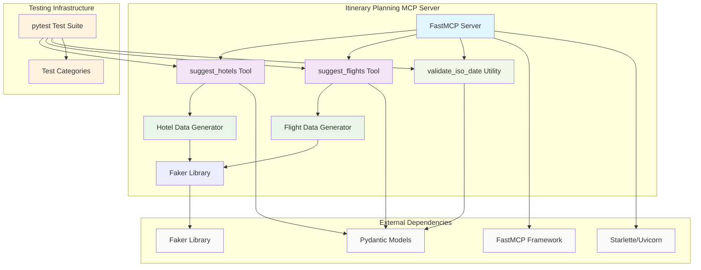

# Itinerary Planning MCP Tools

## Overview

The Itinerary Planning MCP Tools are a Python-based collection of Model Context Protocol (MCP) tools designed to assist with travel planning. These tools provide intelligent suggestions for hotels and flights, generating realistic mock data to help users plan their travel itineraries with comprehensive options and detailed information.

## Architecture

The solution is built using FastMCP and follows a modular, service-oriented architecture:



## Components

### 1. FastMCP Server
- **Purpose**: Main MCP server application using FastMCP framework
- **Technology**: Python 3.12+ with FastMCP
- **Transport**: Server-Sent Events (SSE)
- **Dependencies**:
  - `mcp[cli]` - Model Context Protocol framework
  - `starlette` - ASGI web framework
  - `uvicorn` - ASGI server
  - `faker` - Mock data generation

### 2. suggest_hotels Tool
- **Purpose**: Generates hotel recommendations based on location and dates
- **Input Parameters**:
  - `location`: Target city or area
  - `check_in`: Check-in date (ISO format YYYY-MM-DD)
  - `check_out`: Check-out date (ISO format YYYY-MM-DD)
- **Output**: List of hotel objects with detailed information

### 3. suggest_flights Tool
- **Purpose**: Generates flight recommendations for travel planning
- **Input Parameters**:
  - `from_location`: Departure city/airport
  - `to_location`: Destination city/airport
  - `departure_date`: Departure date (ISO format)
  - `return_date`: Optional return date for round-trip flights
- **Output**: Dictionary with departure and return flight options

### 4. Date Validation Utility
- **Purpose**: Validates ISO date format and ensures logical date relationships
- **Functions**: Input sanitization, format validation, business rule enforcement

### 5. Data Generators
- **Hotel Generator**: Creates realistic hotel data with pricing, amenities, ratings
- **Flight Generator**: Creates realistic flight data with schedules, pricing, connections

## MCP Tools Published

### suggest_hotels
- **Name**: `suggest_hotels`
- **Description**: "Suggest hotels based on location and dates"
- **Parameters**:
  - `location` (string): Location (city or area) to search for hotels
  - `check_in` (string): Check-in date in ISO format (YYYY-MM-DD)
  - `check_out` (string): Check-out date in ISO format (YYYY-MM-DD)
- **Returns**: List of hotel objects with:
  - `name`: Hotel name
  - `address`: Street address
  - `location`: Full location including neighborhood
  - `rating`: Rating (3.0-5.0)
  - `price_per_night`: Price in USD
  - `hotel_type`: Luxury, Boutique, Budget, Business
  - `amenities`: List of available amenities
  - `available_rooms`: Number of available rooms

### suggest_flights
- **Name**: `suggest_flights`
- **Description**: "Suggest flights based on locations and dates"
- **Parameters**:
  - `from_location` (string): Departure location (city or airport)
  - `to_location` (string): Destination location (city or airport)
  - `departure_date` (string): Departure date in ISO format
  - `return_date` (string, optional): Return date in ISO format
- **Returns**: Dictionary containing:
  - `departure_flights`: List of outbound flight options
  - `return_flights`: List of return flight options (if return_date provided)

Each flight object includes:
- `flight_id`: Unique flight identifier
- `airline`: Airline name
- `flight_number`: Flight number
- `aircraft`: Aircraft type
- `from_airport`/`to_airport`: Airport information with codes and names
- `departure`/`arrival`: ISO timestamp strings
- `duration_minutes`: Flight duration
- `is_direct`: Boolean indicating direct vs connecting flight
- `price`: Price in USD
- `currency`: Currency code
- `available_seats`: Number of available seats
- `cabin_class`: Economy, Premium Economy, Business, First
- `segments`: Connection details for non-direct flights

## External Dependencies

### Core Framework
- **mcp[cli] ≥1.3.0**: Model Context Protocol framework with CLI support
- **FastMCP**: High-level MCP server framework
- **Pydantic ≥2.8.0**: Data validation and serialization
- **Starlette ≥0.46.1**: ASGI web framework
- **Uvicorn ≥0.34.0**: ASGI server implementation

### Data Generation
- **Faker ≥37.1.0**: Realistic fake data generation
- **Random**: Built-in Python random number generation
- **UUID**: Unique identifier generation
- **Datetime**: Date and time manipulation

### HTTP Client
- **httpx ≥0.28.1**: Async HTTP client library

### Testing Dependencies
- **pytest ≥8.0.0**: Testing framework
- **pytest-asyncio ≥0.23.0**: Async test support
- **pytest-cov ≥4.0.0**: Test coverage reporting

## Data Models and Validation

### Hotel Data Structure
```python
{
    "name": str,
    "address": str,
    "location": str,
    "rating": float,  # 3.0-5.0
    "price_per_night": int,
    "hotel_type": str,  # Luxury, Boutique, Budget, Business
    "amenities": List[str],
    "available_rooms": int
}
```

### Flight Data Structure
```python
{
    "flight_id": str,  # 8-character unique ID
    "airline": str,
    "flight_number": str,
    "aircraft": str,
    "from_airport": {
        "code": str,  # 3-letter airport code
        "name": str,
        "city": str
    },
    "to_airport": {
        "code": str,
        "name": str,
        "city": str
    },
    "departure": str,  # ISO datetime
    "arrival": str,    # ISO datetime
    "duration_minutes": int,
    "is_direct": bool,
    "price": float,
    "currency": str,
    "available_seats": int,
    "cabin_class": str,
    "segments": List[dict]  # For connecting flights
}
```

## Usage Examples

### Hotel Search
```python
# Search for hotels in Paris
hotels = await suggest_hotels(
    location="Paris",
    check_in="2024-12-25",
    check_out="2024-12-30"
)
```

### Flight Search - One Way
```python
# One-way flight search
flights = await suggest_flights(
    from_location="New York",
    to_location="London",
    departure_date="2024-12-25"
)
```

### Flight Search - Round Trip
```python
# Round-trip flight search
flights = await suggest_flights(
    from_location="San Francisco",
    to_location="Tokyo",
    departure_date="2024-12-25",
    return_date="2025-01-05"
)
```

## Testing

The project includes comprehensive test coverage with 16 test methods organized into focused test classes:

### Test Categories

#### 1. Date Validation Tests (TestValidateIsoDate)
- Valid ISO date parsing
- Invalid format error handling
- Empty string validation
- Null input handling

#### 2. Hotel Suggestion Tests (TestSuggestHotels)
- Valid hotel suggestion structure
- Date validation and error handling
- Rating-based sorting verification
- Multi-location support

#### 3. Flight Suggestion Tests (TestSuggestFlights)
- One-way flight generation
- Round-trip flight generation
- Date validation for flights
- Connecting flight segment validation
- Datetime parsing and validation
- Flight timing constraints
- Airport code format validation

#### 4. Integration Tests (TestIntegration)
- Complete travel planning scenarios
- Cross-tool data consistency
- End-to-end workflow validation

### Running Tests
```bash
cd src/tools/itinerary-planning

# Install test dependencies
pip install -e ".[test]"

# Run all tests
python -m pytest tests/ -v

# Run with coverage
python -m pytest tests/ --cov=src --cov-report=html
```

### Test Results
- **16 tests** covering all functionality
- **100% pass rate** with comprehensive validation
- **Edge case coverage** including error scenarios
- **Performance validation** for reasonable response times

## Configuration and Deployment

### Local Environment Setup

1. Create a [Python virtual environment](https://docs.python.org/3/tutorial/venv.html#creating-virtual-environments) and activate it:

    ```bash
    uv venv
    ```

2. Install the MCP server packages:

    ```bash
    uv pip install -e src/tools/itinerary-planning
    ```

3. Run the MCP server:

    ```shell
    uv run src/tools/itinerary-planning/src/app.py
    ```

### Development Setup
```bash
# Install dependencies
pip install -e ".[test]"

# Run the server
python src/mcp_server.py
```

### Debug with MCP Inspector

For testing and debugging MCP functionality, use the MCP Inspector:

```cmd
uv run mcp dev src/tools/itinerary-planning/src/mcp_server.py
```

### Server Configuration
```python
from mcp.server.fastmcp import FastMCP

mcp = FastMCP("itinerary-planning")

# Tools are automatically registered with @mcp.tool() decorator
# Server runs with SSE transport on default port
```

### Docker Deployment
The project includes a Dockerfile for containerized deployment:
```dockerfile
# Multi-stage build with Python 3.12
# Optimized for production deployment
# Includes all dependencies and source code
```

## Data Generation Logic

### Hotel Generation
- **Types**: Luxury, Boutique, Budget, Business
- **Pricing**: Dynamic pricing based on hotel type
  - Luxury: $250-600/night
  - Boutique: $180-350/night
  - Budget: $80-150/night
  - Business: $150-300/night
- **Amenities**: Random selection from 8 available amenities
- **Ratings**: Random ratings between 3.0-5.0
- **Sorting**: Results sorted by rating (highest first)

### Flight Generation
- **Airlines**: 8 realistic airline names
- **Aircraft**: 6 common aircraft types
- **Scheduling**: Departures between 6 AM - 10 PM
- **Pricing**: $99-999 USD range
- **Connections**: 40% chance of direct flights, 60% connecting
- **Airport Codes**: Algorithmically generated 3-letter codes
- **Timing**: 15-minute departure intervals, 1-8 hour flight durations

## Performance Characteristics

- **Hotel Search**: Generates 3-8 hotels per request
- **Flight Search**: Generates 3-7 flights per direction
- **Response Time**: Sub-second response for all requests
- **Memory Usage**: Lightweight, stateless operation
- **Concurrency**: Fully async, supports multiple concurrent requests

## Security and Validation

- **Input Validation**: Strict ISO date format validation
- **Business Rules**: Ensures logical date relationships
- **Data Sanitization**: Safe handling of all input parameters
- **Error Handling**: Comprehensive error messages and proper exception handling
- **No Persistence**: Stateless operation with no data storage

## Future Enhancements

- **Real Data Integration**: Connect to actual hotel and flight APIs
- **Advanced Filtering**: Price ranges, amenities, airlines preferences
- **Caching**: Response caching for performance optimization
- **Rate Limiting**: Request throttling for production deployment
- **Authentication**: API key or OAuth integration
- **Localization**: Multi-currency and multi-language support
- **Machine Learning**: Personalized recommendations based on user preferences
