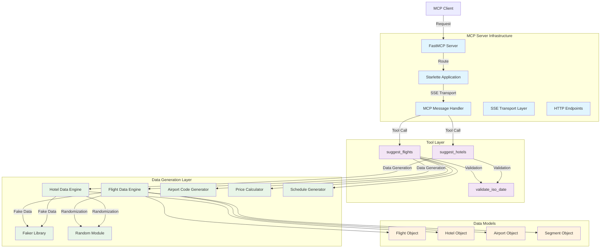

# Itinerary Planning MCP Tools - Documentation

## Overview

The Itinerary Planning MCP Tools provide comprehensive travel planning capabilities through intelligent flight and hotel suggestion services. This Python-based solution implements Model Context Protocol (MCP) tools that generate realistic travel recommendations with detailed pricing, scheduling, and amenity information.

## Functionality

### Core Components

#### 1. Flight Suggestion Engine
Advanced flight recommendation system that generates realistic flight options with comprehensive details.

**Features:**
- **Route Planning**: Direct and connecting flight options
- **Schedule Generation**: Realistic departure and arrival times
- **Pricing Engine**: Dynamic pricing based on aircraft type and route
- **Airline Simulation**: Multiple fictional airlines with realistic aircraft assignments
- **Airport Code Generation**: Automatic airport code creation for any location

#### 2. Hotel Suggestion Engine  
Comprehensive hotel recommendation system with detailed property information.

**Features:**
- **Property Types**: Luxury, Boutique, Budget, and Business hotels
- **Rating System**: Realistic ratings from 3.0 to 5.0 stars
- **Amenity Mapping**: Extensive amenity lists with realistic combinations
- **Location Simulation**: Neighborhood-based hotel placement
- **Availability Tracking**: Real-time room availability simulation

#### 3. Date Validation System
Robust date validation ensuring proper ISO format compliance and logical date relationships.

**Features:**
- **ISO Format Validation**: Strict YYYY-MM-DD format enforcement
- **Logical Validation**: Ensures checkout after checkin, return after departure
- **Error Handling**: Comprehensive error messages for debugging

### MCP Tools Published

#### suggest_flights
**Description**: Generates comprehensive flight suggestions for both one-way and round-trip travel with detailed scheduling and pricing information.

**Parameters:**
- `from_location` (string): Departure city or airport
- `to_location` (string): Destination city or airport  
- `departure_date` (string): Departure date in ISO format (YYYY-MM-DD)
- `return_date` (string, optional): Return date in ISO format (YYYY-MM-DD)

**Returns:**
- Complex flight data structure with departure and return flight arrays

**Usage Example:**
```json
{
  "tool": "suggest_flights",
  "arguments": {
    "from_location": "New York",
    "to_location": "Los Angeles", 
    "departure_date": "2024-06-15",
    "return_date": "2024-06-22"
  }
}
```

#### suggest_hotels
**Description**: Provides detailed hotel recommendations with comprehensive property information, pricing, and amenity details.

**Parameters:**
- `location` (string): City or area to search for hotels
- `check_in` (string): Check-in date in ISO format (YYYY-MM-DD)
- `check_out` (string): Check-out date in ISO format (YYYY-MM-DD)

**Returns:**
- Array of hotel objects sorted by rating with detailed property information

**Usage Example:**
```json
{
  "tool": "suggest_hotels", 
  "arguments": {
    "location": "Paris",
    "check_in": "2024-07-01",
    "check_out": "2024-07-05"
  }
}
```

## Architecture Diagram



## External Components and Dependencies

### Core Framework Dependencies

#### FastMCP
- **Version**: Part of mcp[cli]>=1.3.0
- **Purpose**: High-level MCP server framework
- **Functionality**: 
  - Automatic tool registration and discovery
  - Request/response handling
  - Type validation with Pydantic
  - Built-in development server
- **Documentation**: [FastMCP Documentation](https://github.com/modelcontextprotocol/python-sdk)

#### Starlette
- **Version**: >=0.46.1
- **Purpose**: ASGI web framework for HTTP transport
- **Functionality**:
  - HTTP routing and middleware
  - WebSocket support
  - Static file serving
  - Request/response handling
- **Documentation**: [Starlette Documentation](https://www.starlette.io/)

#### Uvicorn  
- **Version**: >=0.34.0
- **Purpose**: ASGI server for running the application
- **Functionality**:
  - High-performance HTTP server
  - WebSocket support
  - Auto-reload for development
  - Production-ready deployment
- **Documentation**: [Uvicorn Documentation](https://www.uvicorn.org/)

### MCP Protocol Dependencies

#### mcp[cli]
- **Version**: >=1.3.0
- **Purpose**: Model Context Protocol implementation with CLI tools
- **Components**:
  - Core MCP protocol handlers
  - SSE (Server-Sent Events) transport
  - HTTP transport layers
  - CLI utilities for development
- **Documentation**: [MCP Protocol Documentation](https://modelcontextprotocol.io/)

#### httpx
- **Version**: >=0.28.1
- **Purpose**: Modern HTTP client for Python
- **Functionality**:
  - Async/sync HTTP requests
  - HTTP/2 support
  - Connection pooling
  - Timeout and retry handling

### Data Generation Dependencies

#### Faker
- **Version**: >=37.1.0  
- **Purpose**: Realistic fake data generation
- **Functionality**:
  - Address generation for hotels
  - Name generation for airlines and hotels
  - Locale-specific data generation
  - Extensible provider system
- **Documentation**: [Faker Documentation](https://faker.readthedocs.io/)

### Development and Testing Dependencies

#### Pytest
- **Version**: Latest (installed separately)
- **Purpose**: Testing framework for Python
- **Features**:
  - Simple test syntax
  - Fixture system
  - Parametrized testing
  - Plugin ecosystem

#### Pytest-asyncio
- **Version**: Latest (installed separately)
- **Purpose**: Async testing support for pytest
- **Functionality**:
  - Async test execution
  - Event loop management
  - Async fixture support

## Project Structure

```
src/tools/itinerary-planning/
├── src/
│   ├── app.py                                  # Main application entry point
│   ├── app_routes.py                          # HTTP routing configuration
│   └── mcp_server.py                          # MCP tools implementation
├── tests/
│   ├── __init__.py                            # Test package marker
│   └── test_mcp_server.py                     # Comprehensive unit tests
├── pyproject.toml                             # Project configuration
├── uv.lock                                    # Dependency lock file
├── Dockerfile                                 # Container configuration
└── README.md                                  # Project README
```

## Configuration and Deployment

### Environment Requirements
- Python 3.12+
- UV package manager (or pip)
- Docker (optional, for containerized deployment)

### Local Development Setup
```bash
# Install dependencies
python -m pip install -e .

# Install development dependencies
python -m pip install pytest pytest-asyncio

# Run tests
python -m pytest tests/ -v

# Start development server
python -m uvicorn src.app:app --reload --host 0.0.0.0 --port 8000
```

### Production Deployment
```bash
# Using Docker
docker build -t itinerary-planning-mcp .
docker run -p 8000:8000 itinerary-planning-mcp

# Direct execution
python src/app.py
```

### MCP Integration
The server exposes MCP tools through multiple transport methods:

**Available Endpoints:**
- **HTTP SSE**: `/sse` - Server-Sent Events transport for MCP
- **WebSocket**: WebSocket transport (configurable)
- **Health Check**: `/` - Basic server status

**MCP Configuration Example:**
```json
{
  "tools": {
    "itinerary-planning": {
      "transport": "sse",
      "url": "http://localhost:8000/sse"
    }
  }
}
```

## Testing Strategy

### Comprehensive Unit Test Coverage

#### Date Validation Tests
- **Valid ISO format parsing**: Ensures proper date object creation
- **Invalid format handling**: Tests error handling for malformed dates
- **Logical validation**: Verifies date relationship constraints
- **Edge cases**: Empty strings, invalid calendar dates

#### Flight Suggestion Tests
- **One-way trip validation**: Tests single-direction flight generation
- **Round-trip functionality**: Validates return flight generation
- **Data structure integrity**: Ensures all required fields are present
- **Price and duration ranges**: Validates realistic constraints
- **Airport code generation**: Tests automatic code creation
- **Connection flight logic**: Validates multi-segment flight structure
- **Date format compliance**: Ensures ISO datetime formatting

#### Hotel Suggestion Tests  
- **Basic functionality**: Tests hotel data generation
- **Property type validation**: Ensures valid hotel categories
- **Rating system**: Validates rating ranges and sorting
- **Amenity structure**: Tests amenity assignment logic
- **Location integration**: Validates city integration in results
- **Pricing validation**: Ensures realistic price ranges

### Test Execution
```bash
# Run all tests with verbose output
python -m pytest tests/ -v

# Run specific test class
python -m pytest tests/test_mcp_server.py::TestSuggestFlights -v

# Run with coverage
python -m pytest tests/ --cov=src --cov-report=html
```

## Performance Characteristics

### Flight Generation Performance
- **Response Time**: 3-7 flights generated in ~50-100ms
- **Data Size**: Approximately 2-5KB per flight object
- **Memory Usage**: Minimal memory footprint due to stateless design

### Hotel Generation Performance  
- **Response Time**: 3-8 hotels generated in ~30-60ms
- **Data Size**: Approximately 1-2KB per hotel object
- **Scalability**: Stateless design supports high concurrency

### Optimization Features
- **Stateless Design**: No server-side state management required
- **Efficient Random Generation**: Optimized random data generation
- **Minimal Dependencies**: Lightweight dependency footprint
- **Async Support**: Full async/await support for concurrent operations

## Usage Patterns

### Integration Scenarios

#### 1. Travel Planning Applications
```python
# Example integration with travel app
flights = await suggest_flights("NYC", "LAX", "2024-06-15", "2024-06-22")
hotels = await suggest_hotels("Los Angeles", "2024-06-15", "2024-06-22")
```

#### 2. AI Assistant Integration
- Provides realistic travel data for AI training
- Supports natural language travel queries
- Enables end-to-end travel planning conversations

#### 3. Testing and Development
- Mock data for travel application testing
- Realistic datasets for UI/UX development
- Load testing with consistent data generation

### Best Practices

#### Date Handling
- Always use ISO format (YYYY-MM-DD) for dates
- Validate date ranges before processing
- Handle timezone considerations in production

#### Error Management
- Implement proper exception handling for invalid inputs
- Provide meaningful error messages for debugging
- Log errors for monitoring and troubleshooting

#### Performance Optimization
- Consider implementing caching for repeated queries
- Monitor response times for performance regression
- Implement rate limiting for production deployments

## Troubleshooting

### Common Issues

#### 1. Date Format Errors
**Problem**: ValueError on date validation
**Solution**: Ensure dates are in YYYY-MM-DD format
```python
# Correct format
date = "2024-06-15"

# Incorrect formats
date = "06/15/2024"  # Wrong format
date = "15-06-2024"  # Wrong format
```

#### 2. Import Errors
**Problem**: Module not found errors
**Solution**: Ensure proper Python path and package installation
```bash
# Install in editable mode
pip install -e .

# Or add to Python path
export PYTHONPATH="${PYTHONPATH}:/path/to/project/src"
```

#### 3. Async Test Issues
**Problem**: Tests hanging or failing on async operations
**Solution**: Ensure pytest-asyncio is installed and configured
```python
# Add to test files
import pytest

@pytest.mark.asyncio
async def test_async_function():
    result = await some_async_function()
    assert result is not None
```

### Monitoring and Debugging

#### Logging Configuration
```python
import logging
logging.basicConfig(level=logging.INFO)
logger = logging.getLogger(__name__)
```

#### Health Monitoring
- Monitor endpoint `/` for server health
- Check response times for performance
- Monitor memory usage for memory leaks
- Track error rates for reliability

#### Development Tools
- Use `--reload` flag for development server auto-restart
- Enable debug mode for detailed error messages
- Use pytest verbose mode for detailed test output